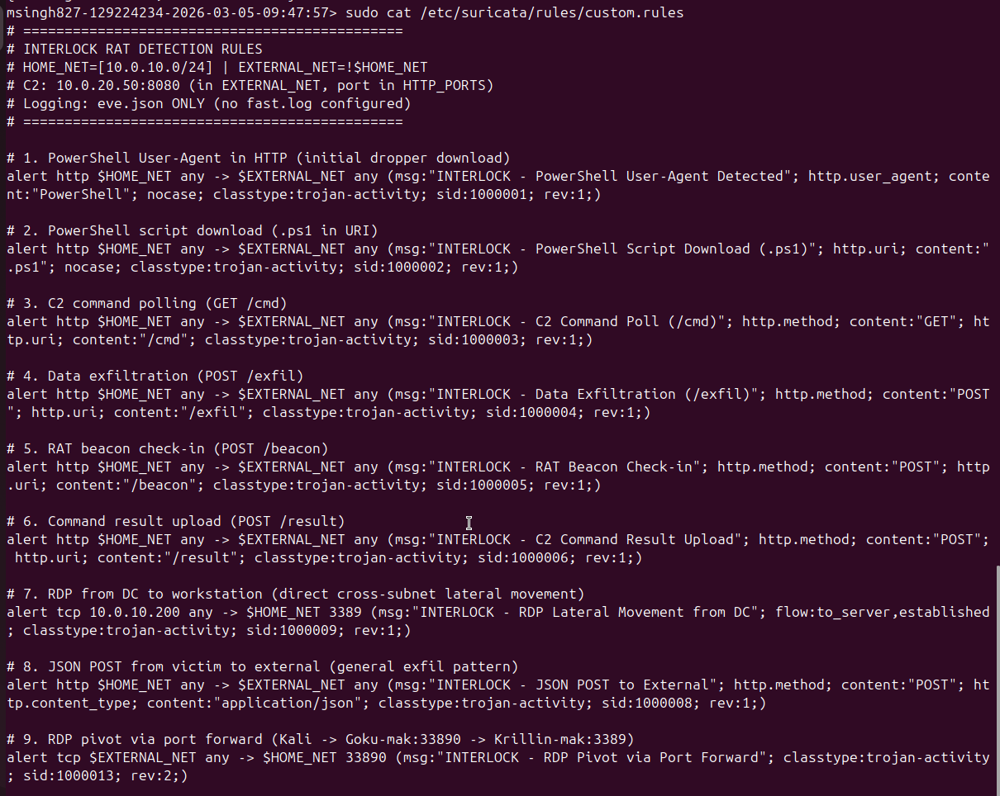
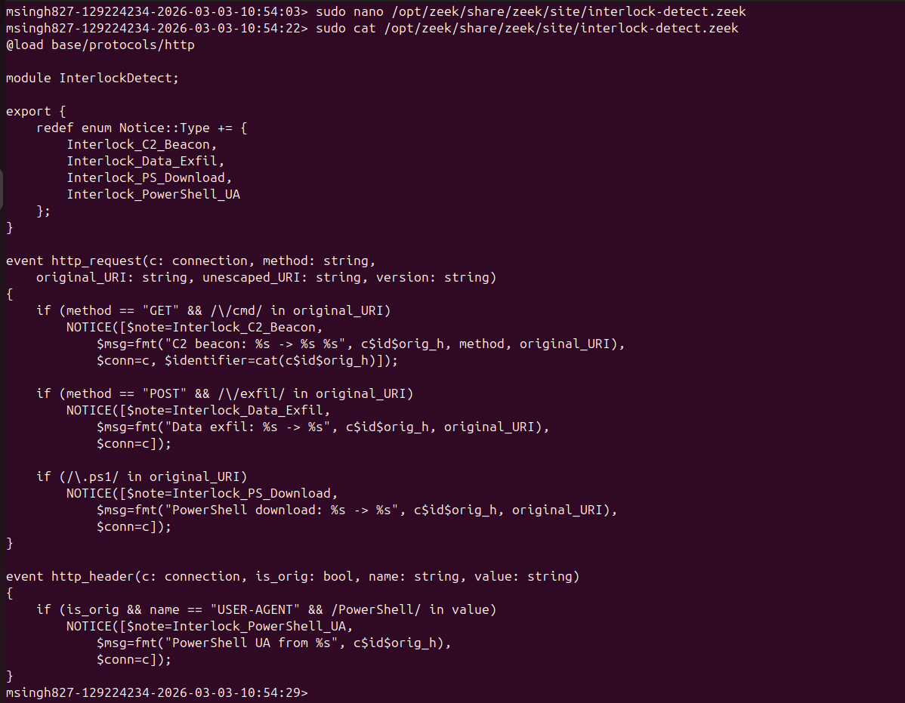
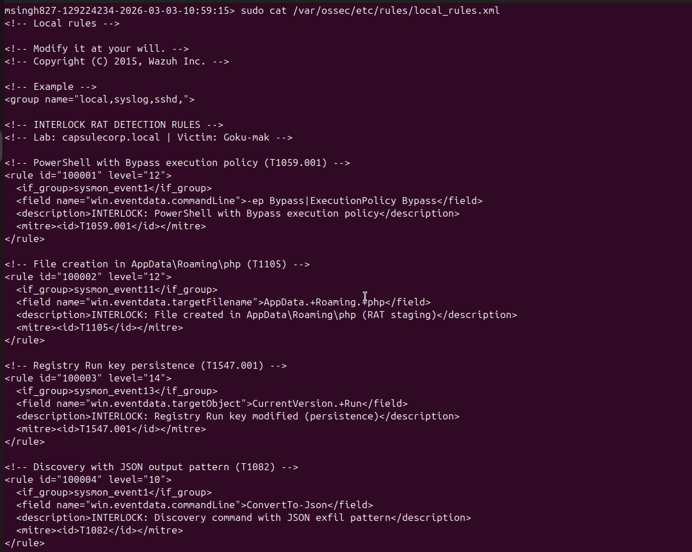
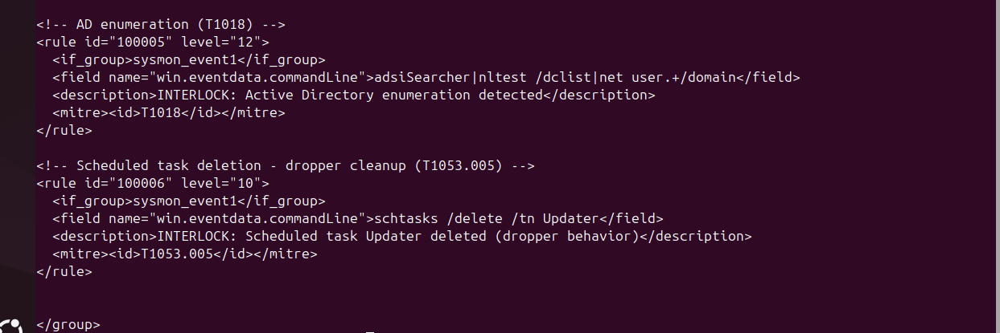

# 🛡️ Interlock RAT Threat Simulation & Detection

> End-to-end simulation of the **KongTuke FileFix → Interlock RAT** attack chain in a segmented enterprise lab, with custom defense-in-depth detection across Suricata IDS/IPS, Zeek NSM, and Wazuh HIDS — including automated IPS blocking and a 10-visualization SIEM dashboard.

[]()
[]()
[]()
[]()
[]()
[]()

---

## Table of Contents

1. [Executive Summary](#1-executive-summary)
2. [Threat Background](#2-threat-background)
3. [Lab Architecture](#3-lab-architecture)
4. [Attack Chain Walkthrough](#4-attack-chain-walkthrough)
5. [Detection Engineering](#5-detection-engineering)
6. [Automated Detection & Response](#6-automated-detection--response)
7. [Wazuh SIEM Dashboard](#7-wazuh-siem-dashboard)
8. [Detection Coverage Summary](#8-detection-coverage-summary)
9. [Key Metrics](#9-key-metrics)
10. [Lessons Learned](#10-lessons-learned)
11. [Skills Demonstrated](#11-skills-demonstrated)
12. [Tech Stack](#12-tech-stack)
13. [Repository Structure](#13-repository-structure)
14. [Disclaimer](#14-disclaimer)
15. [Author](#15-author)

---

## 1. Executive Summary

This project replicates a real-world ransomware initial-access technique end-to-end and builds the detection stack a defender would deploy against it. The threat replicated is the **KongTuke FileFix → Interlock RAT** chain documented by The DFIR Report on July 14, 2025 — a clipboard-based PowerShell delivery technique that drops a PHP-variant remote access trojan, performs automated discovery, establishes persistence, exfiltrates host telemetry, and enables hands-on-keyboard lateral movement via RDP.

The detection layer is intentionally **defense-in-depth**: three independent telemetry pipelines (Suricata IDS/IPS at the network edge, Zeek NSM for protocol metadata, Wazuh HIDS with Sysmon for endpoint events) each carry their own custom rules — 9 Suricata alert signatures, 3 Suricata IPS DROP signatures, 4 Zeek notice types, and 6 Wazuh rules with explicit MITRE ATT&CK mappings. Every layer fired during the simulation, every layer is mapped to a kill-chain phase in the coverage matrix, and the entire pipeline is unified inside a 10-visualization Wazuh OpenSearch dashboard for SOC-style triage.

The lab is a four-VM segmented VMware environment representing the `CAPSULECORP.LOCAL` Active Directory domain, with all inter-subnet traffic forced through an Ubuntu router running the complete monitoring stack. The project also demonstrates **automated response**: Suricata IPS DROP rules and Wazuh `firewall-drop` active response close the loop from detection to blocking, and a Bash daemon (`alert_monitor.sh`) provides a real-time analyst feed off `eve.json`.

## 2. Threat Background

**Interlock** is a ransomware-as-a-service group active since late 2024 whose initial-access tradecraft has shifted toward social-engineering techniques that bypass traditional macro-based and attachment-based phishing detection. The group's most recent campaigns rely on **KongTuke FileFix** — compromised legitimate websites that serve a fake browser verification page. The page uses JavaScript to copy a hidden PowerShell one-liner to the user's clipboard, then instructs the victim to press `Win + R` and `Ctrl + V`, paste, and Enter to "complete verification." The Run dialog executes the pasted command, which downloads and runs a dropper script, which in turn fetches the **Interlock RAT** — historically delivered as a PHP-variant trojan staged in `%APPDATA%\php\`.

The RAT performs automated host discovery (`systeminfo`, `tasklist`, services, drives, ARP, privilege check) on launch, exfiltrates the results as JSON, establishes persistence via the `HKCU\…\Run` registry key, and enters a polling loop to receive interactive commands from the operator. Subsequent activity typically includes Active Directory enumeration, scheduled-task abuse for cleanup, and RDP pivots to additional endpoints inside the domain.

**Reference:** [The DFIR Report — *KongTuke FileFix Leads to New Interlock RAT Variant* (July 14, 2025)](https://thedfirreport.com/2025/07/14/kongtuke-filefix-leads-to-new-interlock-rat-variant/)

## 3. Lab Architecture

The lab topology is a two-subnet enterprise model. The attacker subnet (`10.0.20.0/24`, VLAN 20) hosts Kali. The victim subnet (`10.0.10.0/24`, VLAN 10) hosts the Active Directory domain. All inter-subnet traffic traverses the Ubuntu router, where Suricata inspects packets inline via NFQUEUE before forwarding.


*Figure 1: Lab Network Topology — Four-VM segmented environment with Suricata IPS, Zeek NSM, and Wazuh SIEM on the Router.*

| Host | IP | OS | Role |
|---|---|---|---|
| Kali Linux | 10.0.20.50 | Kali | Attacker — Flask C2 (8080), Apache (80), FileFix lure, sdl-freerdp3 |
| Router | 10.0.20.1 / 10.0.10.1 | Ubuntu 24.04 | Suricata IPS (NFQUEUE), Zeek NSM, Wazuh Manager |
| Goku-mak | 10.0.10.200 | Windows Server 2019 | Domain Controller (CAPSULECORP.LOCAL), AD DS, DNS — primary target |
| Krillin-mak | 10.0.10.205 | Windows 10 Pro | Domain workstation — lateral movement target |

Sysmon (SwiftOnSecurity configuration) is deployed on both Windows hosts to provide high-fidelity Event 1 (process creation), Event 11 (file creation), and Event 13 (registry modification) telemetry to the Wazuh agents.


*Figure 2: Apache web server running on Kali — serving payload files on port 80.*


*Figure 3: Suricata IPS active on the Router — running in NFQUEUE mode (queue 0) for inline packet inspection.*


*Figure 4: Suricata configuration loaded — custom rules file and EVE JSON logging confirmed.*


*Figure 5: Wazuh Manager running on the Router — agent management and alert correlation service active.*


*Figure 6: Zeek NSM running on the Router — monitoring ens35 (victim subnet interface) for network metadata collection.*

## 4. Attack Chain Walkthrough

### 4.1 Initial Access — KongTuke FileFix Lure

A static HTML page hosted on Apache (`http://10.0.20.50/filefix/`) impersonates a "Verify you are human" prompt. When the victim clicks the button, JavaScript writes a PowerShell one-liner into a hidden `<textarea>` and copies it to the clipboard via `document.execCommand('copy')`. The page then reveals "paste-and-press-Enter" instructions. The full lure is in [`attack-infrastructure/filefix-lure.html`](attack-infrastructure/filefix-lure.html).


*Figure 12: FileFix lure page HTML source — JavaScript clipboard manipulation and social engineering interface.*


*Figure 13: FileFix lure page rendered in browser — victim sees verification prompt with paste instructions.*


*Figure 21: FileFix lure page displayed on Goku-mak — victim navigates to the attacker-hosted verification page.*


*Figure 22: Social engineering trigger — clicking the button copies the PowerShell command and reveals paste instructions.*


*Figure 23: PowerShell execution via Run dialog — dropper downloads and executes the RAT on the victim machine.*

### 4.2 Execution — Dropper → RAT

The dropper ([`attack-infrastructure/payload.ps1`](attack-infrastructure/payload.ps1)) follows the exact behavioral pattern in The DFIR Report's analysis: deletes the `Updater` scheduled task (cleanup pattern), creates `%APPDATA%\php\`, downloads `rat.ps1` from Apache with a `User-Agent: PowerShell` header, saves it as `wefs.cfg`, and pipes it to `iex` for in-memory execution.

The RAT ([`attack-infrastructure/rat.ps1`](attack-infrastructure/rat.ps1)) executes in three phases — automated discovery, registry persistence, and a 30-second beacon loop — handed off in the same launch.


*Figure 14: Dropper script (payload.ps1) — staged download chain: task cleanup, directory creation, RAT download.*


*Figure 15: RAT script (rat.ps1) — automated discovery, beacon data structure, and exfiltration logic.*


*Figure 16: RAT script continued — persistence mechanism and C2 beacon loop with command execution switch.*

### 4.3 Persistence — HKCU Run Key

The RAT writes the `InterlockSim` value to `HKCU\Software\Microsoft\Windows\CurrentVersion\Run`, pointing to `powershell.exe -ep Bypass -File C:\Users\Gokuadm-mak\AppData\Roaming\php\wefs.cfg`. This is detected at the host layer by Wazuh rule `100003` (level 14, MITRE T1547.001) via Sysmon Event ID 13.


*Figure 51: Registry persistence — InterlockSim Run key pointing to the RAT file in the php staging directory.*

### 4.4 Discovery — Automated Phase 1 + Hands-on-Keyboard

On launch, the RAT runs the same discovery commands documented in the DFIR Report: `systeminfo /FO CSV`, `tasklist /svc /FO CSV`, `Get-Service`, `Get-PSDrive -PSProvider FileSystem`, `Get-NetNeighbor` (ARP), and a `WindowsPrincipal` privilege check. All results are converted to JSON and POSTed to `/exfil`. After Phase 1, the operator queues seven hands-on-keyboard commands (whoami, tasklist, AD computer count via `adsiSearcher`, `nltest /dclist`, `net user Gokuadm-mak /domain`, `dir AppData\Roaming`, Veeam server search) through `/opt/c2/commands/next_cmd.json`.


*Figure 29: C2 command results — output from hands-on-keyboard discovery commands executed through the RAT.*


*Figure 30: C2 loot directory — beacon, exfiltration, and command result JSON files collected during the attack.*

### 4.5 C2 Communication — Custom Flask Server

The C2 ([`attack-infrastructure/c2_server.py`](attack-infrastructure/c2_server.py)) is a deliberately small Flask app with four endpoints: `POST /beacon` for initial check-ins, `POST /exfil` for discovery dumps, `GET /cmd` for the 30-second polling loop, and `POST /result` for command output. Loot is timestamped into `/opt/c2/loot/`. Every endpoint generates a Suricata signature hit at the network layer.


*Figure 7: C2 server script (c2_server.py) — Flask application with /beacon, /exfil, /cmd, and /result endpoints.*


*Figure 8: C2 server script continued — command queuing mechanism and result collection.*


*Figure 9: C2 server launched — Flask listening on 0.0.0.0:8080 with loot directory initialized.*


*Figure 10: C2 test beacon — curl POST confirming beacon data successfully received and stored.*


*Figure 11: C2 loot verification — test beacon JSON file created in /opt/c2/loot/ directory.*


*Figure 24: C2 server receiving beacon and exfiltration data — automated discovery data exfiltrated within seconds.*

### 4.6 Lateral Movement — RDP Pivot via netsh portproxy

From an elevated PowerShell session on Goku-mak, the operator configures `netsh interface portproxy add v4tov4 listenport=33890 connectaddress=10.0.10.205 connectport=3389` and opens the firewall, turning the compromised DC into a relay. Kali then connects via `sdl-freerdp3` to `10.0.10.200:33890`, which is forwarded transparently to Krillin-mak:3389. The ingress leg traverses the router and is detected at the network layer (Suricata SID 1000013); the egress leg stays inside the victim subnet and is detected at the host layer (Wazuh rule 92657).


*Figure 31: RDP enabled on Krillin-mak — registry modification, firewall rules, and NLA disabled for third-party RDP clients.*


*Figure 32: Port forward configured on Goku-mak — netsh portproxy relaying 33890 to Krillin-mak:3389 with firewall rule.*


*Figure 33: RDP session established through the pivot — Kali connected to Krillin-mak desktop via Goku-mak port 33890.*

## 5. Detection Engineering

The detection stack is deliberately **layered and independent** — each layer can be reasoned about and validated in isolation, but together they provide overlapping coverage so that a gap in one layer (e.g., intra-subnet RDP that bypasses the network sensor) is closed by another (host-layer logon detection on Krillin-mak).

### 5.1 Suricata IDS/IPS

Nine custom signatures cover the network-observable side of the kill chain: PowerShell User-Agent, `.ps1` URI, `/cmd` polling, `/exfil` POST, `/beacon` POST, `/result` POST, generic JSON POST to external, RDP-to-DC, and the `:33890` pivot port. The full ruleset (with the three IPS DROP rules added in Step 11) lives in [`detection-rules/suricata/custom.rules`](detection-rules/suricata/custom.rules).



*Figure 17: Suricata custom rules — nine signatures covering PowerShell download, C2 communication, exfiltration, and lateral movement.*

```bash
# Validate config and reload rules without restarting (uses /var/run/suricata-command.socket)
sudo suricata -T -c /etc/suricata/suricata.yaml -v 2>&1 | tail -5
sudo suricatasc -c reload-rules
sudo suricatasc -c ruleset-stats
```

| SID | Action | Coverage | MITRE |
|---|---|---|---|
| 1000001 | alert | PowerShell User-Agent in HTTP | T1071.001 |
| 1000002 | alert | `.ps1` in URI | T1105 |
| 1000003 | alert | `GET /cmd` (C2 poll) | T1071.001 |
| 1000004 | alert | `POST /exfil` | T1041 |
| 1000005 | alert | `POST /beacon` | T1071.001 |
| 1000006 | alert | `POST /result` | T1071.001 |
| 1000008 | alert | JSON POST to external | T1041 |
| 1000009 | alert | RDP from DC to workstation | T1021.001 |
| 1000013 | alert | RDP pivot via port 33890 | T1021.001 |
| 1000010–1000012 | drop | IPS BLOCK: `/cmd`, `/exfil`, PowerShell UA | — |

### 5.2 Zeek NSM

The Zeek script [`detection-rules/zeek/interlock-detect.zeek`](detection-rules/zeek/interlock-detect.zeek) raises four custom `Notice::Type` values from `http_request` and `http_header` events, providing protocol-aware metadata that complements Suricata's signature-based detection.



*Figure 18: Zeek detection script (interlock-detect.zeek) — four custom notice types for Interlock-specific HTTP patterns.*

| Notice Type | Trigger | MITRE |
|---|---|---|
| `Interlock_C2_Beacon` | `GET` request with `/cmd` in URI | T1071.001 |
| `Interlock_Data_Exfil` | `POST` request with `/exfil` in URI | T1041 |
| `Interlock_PS_Download` | Any URI containing `.ps1` | T1105 |
| `Interlock_PowerShell_UA` | `User-Agent` header containing `PowerShell` | T1059.001 |

### 5.3 Wazuh HIDS

Six Wazuh rules in [`detection-rules/wazuh/local_rules.xml`](detection-rules/wazuh/local_rules.xml) target Sysmon-derived host events. Rule 100001 fires on PowerShell `-ep Bypass` (Sysmon Event 1), rule 100002 on file creation in `AppData\Roaming\php` (Event 11), rule 100003 on `Run`-key registry writes (Event 13, level 14), rule 100004 on `ConvertTo-Json` discovery commands, rule 100005 on AD enumeration tooling, and rule 100006 on the `schtasks /delete /tn Updater` cleanup pattern.



*Figure 19: Wazuh custom rules (local_rules.xml) — rules 100001–100003 with MITRE ATT&CK technique mappings.*



*Figure 20: Wazuh custom rules continued — rules 100004–100006 covering discovery, AD enumeration, and scheduled task abuse.*

| Rule ID | Level | Description | MITRE |
|---|---|---|---|
| 100001 | 12 | PowerShell with Bypass execution policy | T1059.001 |
| 100002 | 12 | File created in `AppData\Roaming\php` (RAT staging) | T1105 |
| 100003 | 14 | Registry Run key modified (persistence) | T1547.001 |
| 100004 | 10 | Discovery command with JSON exfil pattern | T1082 |
| 100005 | 12 | Active Directory enumeration | T1018 |
| 100006 | 10 | `schtasks /delete /tn Updater` (dropper cleanup) | T1053.005 |

### 5.4 Consolidated Detection Matrix

| Phase | Suricata SID | Zeek Notice | Wazuh Rule | MITRE |
|---|---|---|---|---|
| PowerShell Download | 1000001, 1000002 | `Interlock_PS_Download`, `Interlock_PowerShell_UA` | 100001 | T1059.001 |
| C2 Beacon | 1000003, 1000005 | `Interlock_C2_Beacon` | 86601 (forwarded) | T1071.001 |
| Data Exfiltration | 1000004, 1000008 | `Interlock_Data_Exfil` | 100004 | T1041 / T1082 |
| Persistence | — | — | 100003 (level 14) | T1547.001 |
| AD Enumeration | — | — | 100005 | T1018 |
| Scheduled Task Cleanup | — | — | 100006 | T1053.005 |
| RDP Lateral Movement | 1000009, 1000013 | `conn.log` | 60106, 92657 | T1021.001 / T1078 |
| IPS Block | 1000010–1000012 | — | 86601 (BLOCK) | — |

### 5.5 Live Detection Output


*Figure 25: Suricata alerts (Terminal 1) — real-time JSON alerts showing PowerShell User-Agent, Script Download, Beacon.*


*Figure 26: Suricata compact view (Terminal 2) — one-line alert format showing signature names, actions, and source/destination.*


*Figure 27: Zeek HTTP log (Terminal 3) — HTTP transactions to C2 including payload.ps1 download, beacon POST, and exfil POSTs.*


*Figure 28: Zeek notice log (Terminal 4) — custom InterlockDetect notices firing for PowerShell download and User-Agent.*


*Figure 34: Suricata SID 1000013 — RDP Pivot via Port Forward alert firing for traffic from 10.0.20.50 to 10.0.10.200:33890.*


*Figure 35: Zeek conn.log — both pivot legs visible: 10.0.20.50→10.0.10.200:33890 and 10.0.10.200→10.0.10.205:3389.*


*Figure 36: Wazuh Event 4624 — Windows Logon Success on Krillin-mak agent confirming network logon (Type 3).*

## 6. Automated Detection & Response

Detection without automated response is incomplete. This project closes the loop in three places: Suricata IPS DROP rules at the network edge, a Wazuh `firewall-drop` active response at the SIEM, and a real-time Bash daemon for analyst visibility.

### 6.1 Suricata IPS DROP Rules

Three DROP rules (SIDs 1000010–1000012) appended to [`custom.rules`](detection-rules/suricata/custom.rules) target the C2 command poll, exfiltration POSTs, and any HTTP request carrying a `PowerShell` User-Agent. Suricata's action-order is `pass → drop → reject → alert`, so DROP rules take priority over the matching ALERT rules — the EVE log shows `event_type: alert` with `action: blocked` for matched traffic. With these rules active, the kill chain breaks at the Delivery phase: the dropper cannot fetch `payload.ps1`.


*Figure 37: DROP rules added to custom.rules — three IPS rules targeting C2 beacon, exfiltration, and PowerShell download.*


*Figure 38: IPS blocking in action — Suricata eve.json showing action:blocked for INTERLOCK IPS - BLOCK PowerShell Download.*


*Figure 39: Drop event detail — packet dropped with reason:rules, confirming Suricata actively blocked the traffic.*

```bash
# Watch blocked events
sudo tail -f /var/log/suricata/eve.json | \
  jq --unbuffered 'select(.alert.action=="blocked") |
    {timestamp, signature: .alert.signature, src_ip, dest_ip}'
```

### 6.2 Wazuh Active Response

The active-response block in [`detection-rules/wazuh/ossec.conf.snippet`](detection-rules/wazuh/ossec.conf.snippet) wires the built-in `firewall-drop` command to rules 100001 (PowerShell Bypass) and 100003 (Registry Run-key persistence) with a 600-second timeout. When either rule fires, Wazuh executes a local iptables/nftables drop of the offending source IP — a host-driven complement to the network-driven Suricata DROP rules.


*Figure 40: Wazuh active response configuration — firewall-drop command linked to rules 100001 and 100003 with 600s timeout.*

```xml
<active-response>
  <command>firewall-drop</command>
  <location>local</location>
  <rules_id>100001,100003</rules_id>
  <timeout>600</timeout>
</active-response>
```

### 6.3 Real-Time Alert Monitor

[`automation/alert_monitor.sh`](automation/alert_monitor.sh) tails Suricata's `eve.json` (the only configured log output), filters for `INTERLOCK` signatures, formats `[allowed]` vs `[blocked]` events one-per-line, and tees the stream to `/var/log/interlock-alerts.log` for after-action review. It runs as a backgrounded daemon (`bash /opt/scripts/alert_monitor.sh &`) on the Router.


*Figure 41: Alert monitoring script (alert_monitor.sh) — Bash script parsing eve.json for INTERLOCK alerts with action labeling.*

![Figure 42: Alert monitor output — real-time display showing both [allowed] and [blocked] events from the IPS test](images/fig42-alert-monitor-output.png)

*Figure 42: Alert monitor output — real-time display showing both [allowed] and [blocked] events from the IPS test.*

```bash
sudo tail -F /var/log/suricata/eve.json | \
  jq --unbuffered -r 'select(.event_type=="alert" and (.alert.signature | contains("INTERLOCK"))) |
    "[\(.timestamp)] [\(.alert.action // "allowed")] \(.alert.signature) | \(.src_ip):\(.src_port) -> \(.dest_ip):\(.dest_port)"' | \
  while IFS= read -r line; do
    echo "$line" | tee -a /var/log/interlock-alerts.log
  done
```

## 7. Wazuh SIEM Dashboard

A custom **INTERLOCK RAT — Threat Hunting Dashboard** consolidates 10 purpose-built visualizations over the unified `wazuh-alerts-*` index. Each visualization captures one analytical question (alert mix, attack timeline, MITRE technique coverage, IPS effectiveness, agent distribution, PowerShell activity, RDP/logon correlation, severity pyramid, Suricata signature hits, discovery activity). The dashboard is reachable at `https://10.0.10.1` from any host on the victim subnet.

The full per-visualization breakdown — type, fields, filters, screenshots (Figures 54–66), and the analytical finding for each — lives in [`dashboard/DASHBOARD.md`](dashboard/DASHBOARD.md). Highlights below.

**Visualization 1 — INTERLOCK Alert Distribution (Pie).** Suricata RDP Pivot dominates at 63.42%, followed by PowerShell User-Agent (14.44%) and C2 Command Poll (12.52%). Network-layer detection drives volume; endpoint detection drives fidelity.

**Visualization 4 — Suricata IPS Blocked vs Allowed.** The before/after comparison that proves the IPS automation works. With DROP rules active on March 5th, Suricata blocked the PowerShell download, breaking the kill chain at Delivery so no beacon, exfil, or lateral movement ever happened.

**Visualization 7 — RDP & Logon Activity (Dual-Split Table).** Correlates logon events with reporting agent. Rule 92657's pass-the-hash warning, the `CAPSULECORP\Gokuadm-mak` username, the explicit source IP `10.0.10.200`, and the temporal correlation with Suricata's RDP Pivot alerts together produce a high-confidence lateral-movement finding.

**Visualization 9 — Suricata Signature Hits.** All nine custom signatures fired. The hit ratios are internally consistent — beacon (2) vs command poll (314) reflects beacon-once vs poll-every-30-seconds RAT behavior.

For each of the ten visualizations, the field, filter, screenshot, and analytical finding are documented in [`DASHBOARD.md`](dashboard/DASHBOARD.md).

## 8. Detection Coverage Summary

| Attack Phase | Suricata | Zeek | Wazuh |
|---|---|---|---|
| Payload Download | SID 1000001, 1000002 | `PS_Download`, `PowerShell_UA` | Rule 100001 (Bypass) |
| C2 Communication | SID 1000003, 1000005 | `C2_Beacon` notice | Rule 86601 (forwarded) |
| Data Exfiltration | SID 1000004, 1000008 | `Data_Exfil` notice | Rule 100004 (JSON) |
| Persistence | — | — | Rule 100003 (Registry) |
| Discovery | — | — | Rules 92031, 100005 |
| Lateral Movement | SID 1000009, 1000013 | `conn.log` (`:3389`, `:33890`) | Rules 60106, 92657 |
| IPS Blocking | SID 1000010–1000012 | — | Rule 86601 (BLOCK) |

All custom Suricata signatures (9 alert + 3 DROP), all Zeek notice types (4), and all custom Wazuh rules (6) generated actionable alerts during the simulation. The combination of automated IPS blocking and automated SIEM alerting (with `firewall-drop` active response) demonstrates a complete automated detection-and-response pipeline.


*Figure 43: Suricata alert summary — count by signature showing all nine custom rules fired with expected frequencies.*


*Figure 49: Wazuh comprehensive alert summary — all attack-related rules showing detection across PowerShell, discovery, and RDP.*

## 9. Key Metrics

| Metric | Count |
|---|---:|
| RDP Pivot alerts | 1,591 |
| PowerShell User-Agent detections | 336 |
| C2 Command Poll events | 296 |
| JSON POST to External | 35 |
| C2 Command Result Uploads | 31 |
| PowerShell Script Downloads | 10 |
| IPS BLOCK events | 3 |
| RAT Beacon check-ins | 2 |
| Data Exfiltration events | 2 |

## 10. Lessons Learned

Seven non-obvious problems surfaced during the build and were resolved in place. Each is captured here because they are the kind of practical detail that distinguishes an as-deployed pipeline from a textbook architecture.

**1. RDP registry changes require a reboot.** Setting `fDenyTSConnections=0` on Krillin-mak did not immediately open port 3389; the Terminal Services listener only activated after a full reboot. Confirmed with `netstat -an | findstr 3389` before/after.

**2. NLA blocks third-party RDP clients.** Network Level Authentication on Krillin-mak caused `connection reset by peer` errors from `sdl-freerdp3`. Setting `UserAuthentication=0` in the `RDP-Tcp` registry key resolved it.

**3. Suricata `flow:to_server,established` blocked SID 1000013.** The initial RDP-pivot rule never fired because of the flow keyword. Removing it and bumping `rev:2` fixed the rule.

**4. Intra-subnet RDP bypasses Suricata.** SID 1000009 (RDP to 3389) didn't fire for the second pivot leg because the Goku-mak → Krillin-mak segment stays inside `10.0.10.0/24` and never traverses the router. SID 1000013 (port 33890) catches the ingress leg from Kali through the router, and Wazuh rule 92657 catches the host-side logon — together the two layers close the gap.

**5. Zeek logs are JSON, not TSV.** The first evidence-collection commands used `zeek-cut`, which requires Zeek's legacy TSV format. The lab uses JSON-formatted logs, so all queries were rewritten to use `jq` with bracket notation for dotted field names; archived `.gz` logs use `zcat | jq`.

**6. Wazuh `jq` rule-ID comparison is alphabetic.** The initial alert export used `>= "100001"` and produced wrong results because `jq` compares strings alphabetically, not numerically. Switched to exact match / regex filtering.

**7. UAC prevents C2-driven port forwarding.** `netsh interface portproxy` requires elevation, but the simulated RAT runs as a standard user. The pivot was configured directly from an elevated PowerShell session on Goku-mak; a real attacker would have to escalate first.

## 11. Skills Demonstrated

Detection Engineering · Threat Emulation · MITRE ATT&CK Mapping · Network Forensics · IDS/IPS Rule Writing · SIEM Engineering & Dashboarding · Active Directory Security · Lateral Movement Detection · Sysmon & Windows Event Log Analysis · PowerShell · Python (Flask) · Bash · Incident Response Workflow.

## 12. Tech Stack

Suricata 7.0.3 · Zeek NSM · Wazuh 4.14.2 · Sysmon (SwiftOnSecurity config) · OpenSearch Dashboards · Ubuntu 24.04 · Windows Server 2019 · Windows 10 Pro · Kali Linux · Flask · PowerShell · nftables / NFQUEUE.

## 13. Repository Structure

```
interlock-rat-threat-simulation/
├── README.md
├── ARTIFACTS.md
├── LICENSE
├── images/                         (66 figures from the project report)
├── docs/
│   ├── IndividualProjectReport.pdf
│   └── Interlock_RAT_Lab_Manual.docx
├── detection-rules/
│   ├── suricata/
│   │   └── custom.rules            (9 alert SIDs + 3 DROP SIDs)
│   ├── zeek/
│   │   └── interlock-detect.zeek   (4 custom notice types)
│   └── wazuh/
│       ├── local_rules.xml         (custom rules 100001–100006)
│       └── ossec.conf.snippet      (active-response config block)
├── attack-infrastructure/
│   ├── c2_server.py                (Flask C2: /beacon, /exfil, /cmd, /result)
│   ├── payload.ps1                 (dropper)
│   ├── rat.ps1                     (3-phase RAT: discovery, persistence, beacon loop)
│   └── filefix-lure.html           (KongTuke FileFix social engineering page)
├── automation/
│   └── alert_monitor.sh            (real-time eve.json INTERLOCK parser)
└── dashboard/
    └── DASHBOARD.md                (Appendix A — 10 visualizations)
```

## 14. Disclaimer

> ⚠️ This project was conducted entirely within an isolated VMware lab environment for educational purposes as part of SPR600 Security Monitoring at Seneca Polytechnic. All malware, C2 infrastructure, and attack tooling shown here is simulated and intended only for defensive research and detection engineering practice. Do not deploy any code from this repository against systems you do not own or have explicit authorization to test.

## 15. Author

**Makhan Singh** — Honours Bachelor of Technology in Cybersecurity (IFS), Seneca Polytechnic
*Project completed:* March 2026
