# Interlock RAT Threat Simulation & Detection - Final Project Report

> End-to-end emulation of the **KongTuke FileFix → Interlock RAT** ransomware initial-access chain in a segmented enterprise lab, with custom defense-in-depth detection across Suricata IDS/IPS, Zeek NSM, and Wazuh HIDS - including automated IPS blocking and a 10-visualization SIEM dashboard.

[]()
[]()
[]()
[]()
[]()
[]()

**Author:** Makhan Singh - Honours Bachelor of Technology in Cybersecurity (IFS), Seneca Polytechnic
**Course:** SPR600 - Security Monitoring
**Project completed:** March 2026

---

## Table of Contents

1. [Executive Summary](#1-executive-summary)
2. [Threat Background](#2-threat-background)
3. [Lab Architecture](#3-lab-architecture)
4. [Pre-Attack Readiness](#4-pre-attack-readiness)
5. [Attack Infrastructure](#5-attack-infrastructure)
6. [Attack Chain Walkthrough](#6-attack-chain-walkthrough)
7. [Detection Engineering](#7-detection-engineering)
8. [Live Detection Output](#8-live-detection-output)
9. [Automated Detection & Response](#9-automated-detection--response)
10. [Post-Attack Forensic Analysis](#10-post-attack-forensic-analysis)
11. [Wazuh SIEM Dashboard](#11-wazuh-siem-dashboard)
12. [Detection Coverage Summary](#12-detection-coverage-summary)
13. [Key Metrics](#13-key-metrics)
14. [Skills Demonstrated](#15-skills-demonstrated)
15. [Tech Stack](#16-tech-stack)
16. [Repository Structure](#17-repository-structure)
17. [Disclaimer](#18-disclaimer)

---

## 1. Executive Summary

This project replicates a real-world ransomware initial-access technique end-to-end and builds the detection stack a defender would deploy against it. The threat replicated is the **KongTuke FileFix → Interlock RAT** chain documented by The DFIR Report on July 14, 2025 - a clipboard-based PowerShell delivery technique that drops a PHP-variant remote access trojan, performs automated discovery, establishes persistence, exfiltrates host telemetry, and enables hands-on-keyboard lateral movement via RDP.

The detection layer is intentionally **defense-in-depth**: three independent telemetry pipelines - Suricata IDS/IPS at the network edge, Zeek NSM for protocol metadata, and Wazuh HIDS with Sysmon for endpoint events - each carry their own custom rules. Nine Suricata alert signatures, three Suricata IPS DROP signatures, six Zeek notice types, and eight Wazuh rules with explicit MITRE ATT&CK mappings together cover every phase of the kill chain. Every layer fired during the simulation, every layer is mapped to a tactic in the coverage matrix, and the entire pipeline is unified inside a 10-visualization Wazuh OpenSearch dashboard for SOC-style triage.

The lab is a four-VM segmented VMware environment representing the `CAPSULECORP.LOCAL` Active Directory domain, with all inter-subnet traffic forced through an Ubuntu router running the complete monitoring stack. The project also demonstrates **automated response**: Suricata IPS DROP rules and Wazuh `firewall-drop` active response close the loop from detection to blocking, and a Bash daemon (`alert_monitor.sh`) provides a real-time analyst feed off `eve.json`.

## 2. Threat Background

**Interlock** is a ransomware-as-a-service group active since late 2024 whose initial-access tradecraft has shifted toward social-engineering techniques that bypass traditional macro-based and attachment-based phishing detection. The group's most recent campaigns rely on **KongTuke FileFix** - compromised legitimate websites that serve a fake browser verification page. The page uses JavaScript to copy a hidden PowerShell one-liner to the user's clipboard, then instructs the victim to press `Win + R` and `Ctrl + V`, paste, and Enter to "complete verification." The Run dialog executes the pasted command, which downloads and runs a dropper script, which in turn fetches the **Interlock RAT** - historically delivered as a PHP-variant trojan staged in `%APPDATA%\php\`.

The RAT performs automated host discovery (`systeminfo`, `tasklist`, services, drives, ARP, privilege check) on launch, exfiltrates the results as JSON, establishes persistence via the `HKCU\…\Run` registry key, and enters a polling loop to receive interactive commands from the operator. Subsequent activity typically includes Active Directory enumeration, scheduled-task abuse for cleanup, and RDP pivots to additional endpoints inside the domain.

**Reference:** [The DFIR Report - *KongTuke FileFix Leads to New Interlock RAT Variant* (July 14, 2025)](https://thedfirreport.com/2025/07/14/kongtuke-filefix-leads-to-new-interlock-rat-variant/)

## 3. Lab Architecture

The lab topology is a two-subnet enterprise model. The attacker subnet (`10.0.20.0/24`, VLAN 20) hosts Kali. The victim subnet (`10.0.10.0/24`, VLAN 10) hosts the Active Directory domain. All inter-subnet traffic traverses the Ubuntu router, where Suricata inspects packets inline via NFQUEUE before forwarding.

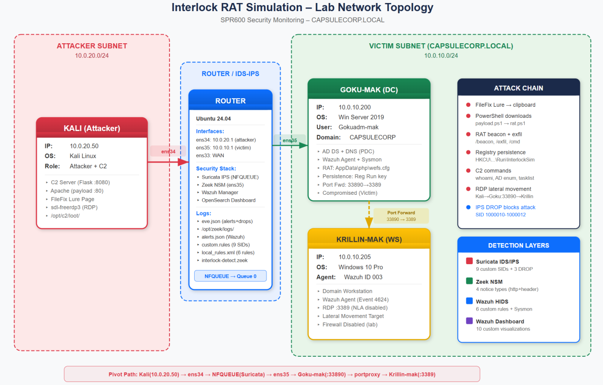

*Figure 1: Lab Network Topology - Four-VM segmented environment with Suricata IPS, Zeek NSM, and Wazuh SIEM on the Router.*

| Host | IP | OS | Role |
|---|---|---|---|
| Kali Linux | 10.0.20.50 | Kali | Attacker - Flask C2 (8080), Apache (80), FileFix lure, sdl-freerdp3 |
| Router | 10.0.20.1 / 10.0.10.1 | Ubuntu 24.04 | Suricata IPS (NFQUEUE), Zeek NSM, Wazuh Manager |
| Goku-mak | 10.0.10.200 | Windows Server 2019 | Domain Controller (CAPSULECORP.LOCAL), AD DS, DNS - primary target |
| Krillin-mak | 10.0.10.205 | Windows 10 Pro | Domain workstation - lateral movement target |

Sysmon (SwiftOnSecurity configuration) is deployed on both Windows hosts to provide high-fidelity Event 1 (process creation), Event 11 (file creation), and Event 13 (registry modification) telemetry to the Wazuh agents.

## 4. Pre-Attack Readiness

Before attack execution, every security service in the monitoring stack was verified to be running and properly configured.

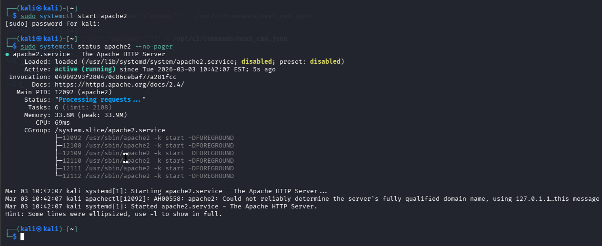

*Figure 2: Apache web server running on Kali - serving payload files on port 80.*

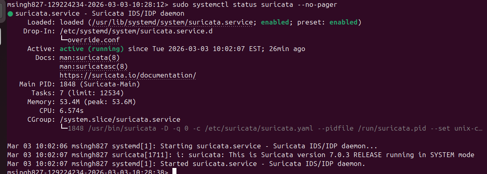

*Figure 3: Suricata IPS active on the Router - running in NFQUEUE mode (queue 0) for inline packet inspection.*

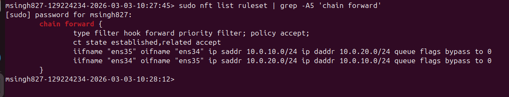

*Figure 4: NFQUEUE forwarding rules - nftables `chain forward` policy on the Router handing all `10.0.10.0/24 ↔ 10.0.20.0/24` traffic to Suricata queue 0 for inline IPS inspection.*

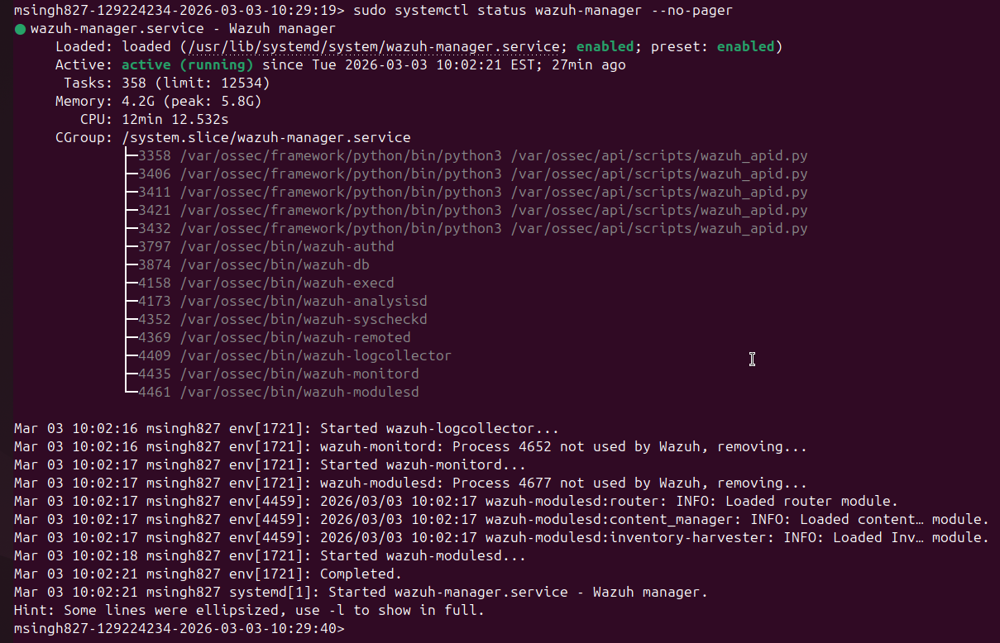

*Figure 5: Wazuh Manager running on the Router - agent management and alert correlation service active.*

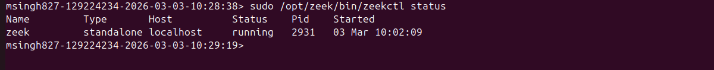

*Figure 6: Zeek NSM running on the Router - monitoring ens35 (victim subnet interface) for network metadata collection.*

## 5. Attack Infrastructure

A complete adversary infrastructure was hand-built on Kali to faithfully reproduce the Interlock campaign's technical behavior - a Flask C2 with the four endpoints documented in The DFIR Report's analysis, a clipboard-based FileFix lure, a PowerShell dropper, and a three-phase RAT.

### 5.1 Flask C2 Server

A custom Flask C2 (`attack-infrastructure/c2_server.py`) exposes four endpoints - `POST /beacon` for initial check-ins, `POST /exfil` for discovery dumps, `GET /cmd` for the 30-second polling loop, and `POST /result` for command output. Loot is timestamped into `/opt/c2/loot/`. Every endpoint generates a Suricata signature hit at the network layer.

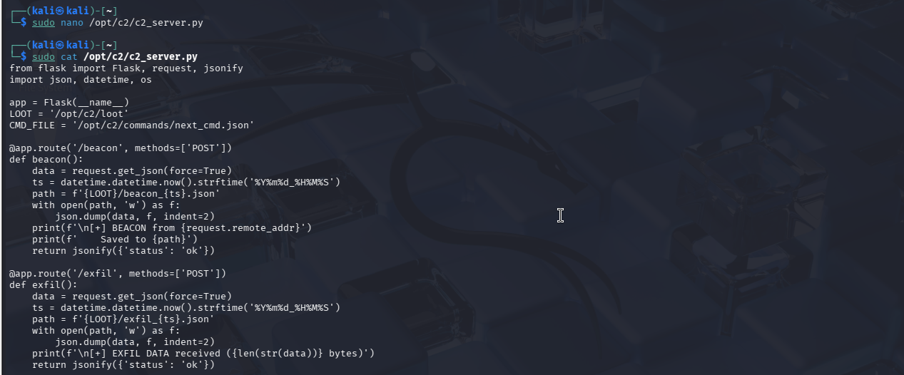

*Figure 7: C2 server script (c2_server.py) - Flask application with /beacon, /exfil, /cmd, and /result endpoints.*

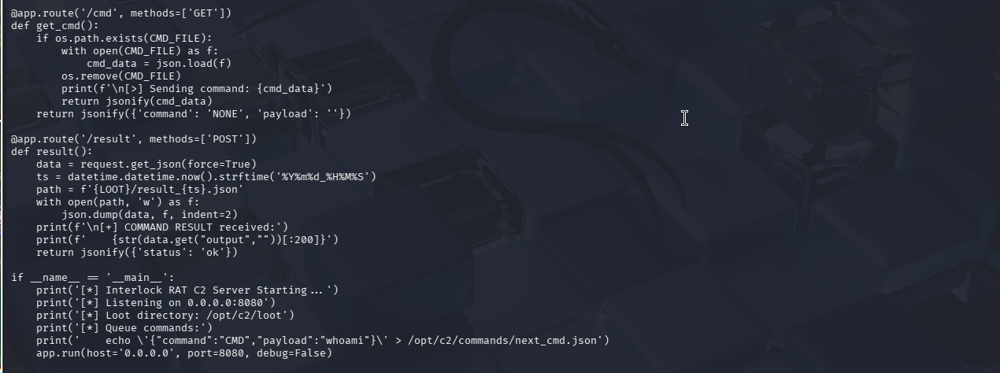

*Figure 8: C2 server script continued - command queuing mechanism and result collection.*

The C2 was tested using a curl POST against `127.0.0.1` to verify JSON serialization and loot persistence before any attack traffic was generated.

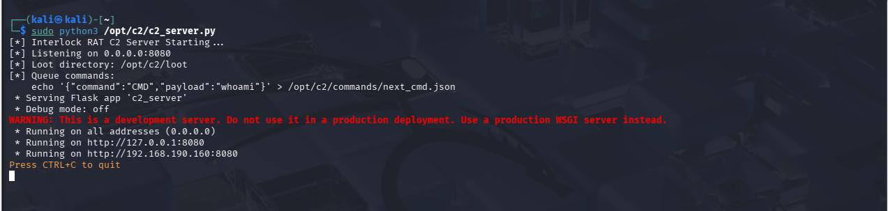

*Figure 9: C2 server launched - Flask listening on 0.0.0.0:8080 with loot directory initialized.*

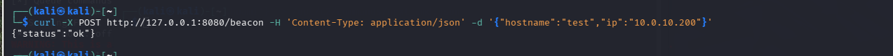

*Figure 10: C2 test beacon - curl POST confirming beacon data successfully received and stored.*

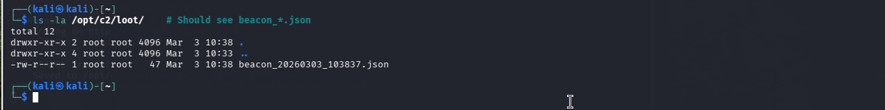

*Figure 11: C2 loot verification - test beacon JSON file created in /opt/c2/loot/ directory.*

### 5.2 KongTuke FileFix Lure

A static HTML page hosted on Apache (`http://10.0.20.50/filefix/`) impersonates a "Verify you are human" prompt. When the victim clicks the button, JavaScript writes a PowerShell one-liner into a hidden `<textarea>` and copies it to the clipboard via `document.execCommand('copy')`. The page then reveals "paste-and-press-Enter" instructions.

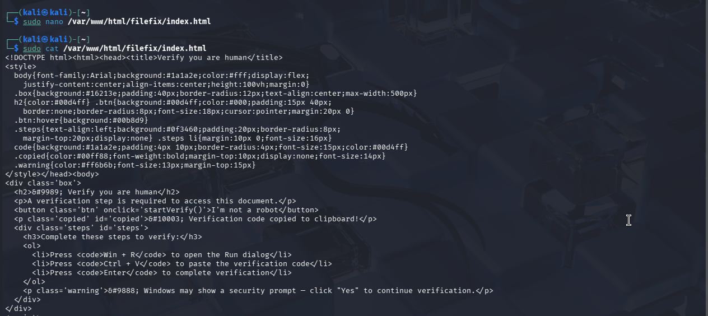

*Figure 12: FileFix lure page HTML source - JavaScript clipboard manipulation and social engineering interface.*

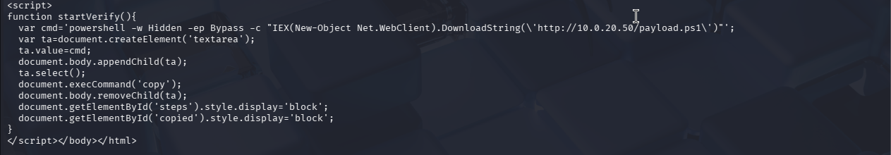

*Figure 13: FileFix lure page JavaScript - the `startVerify()` function builds the PowerShell one-liner, writes it into a hidden textarea, and calls `document.execCommand('copy')` to push it to the victim's clipboard.*

### 5.3 Dropper and RAT

The dropper (`attack-infrastructure/payload.ps1`) follows the exact behavioral pattern described in The DFIR Report's analysis: deletes the `Updater` scheduled task (cleanup pattern), creates `%APPDATA%\php\`, downloads `rat.ps1` from Apache with a `User-Agent: PowerShell` header, saves it as `wefs.cfg`, and pipes the content to `iex` for in-memory execution.

The RAT (`attack-infrastructure/rat.ps1`) executes in three phases handed off in the same launch - automated discovery, registry persistence, and a 30-second beacon loop.

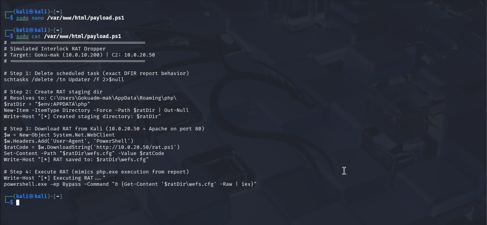

*Figure 14: Dropper script (payload.ps1) - staged download chain: task cleanup, directory creation, RAT download.*

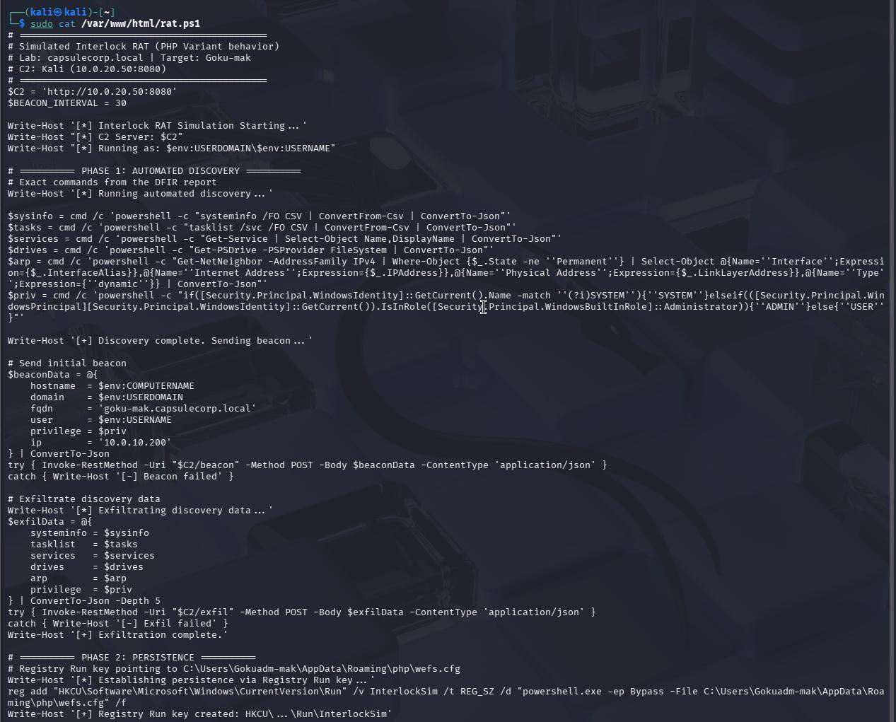

*Figure 15: RAT script (rat.ps1) - automated discovery, beacon data structure, and exfiltration logic.*

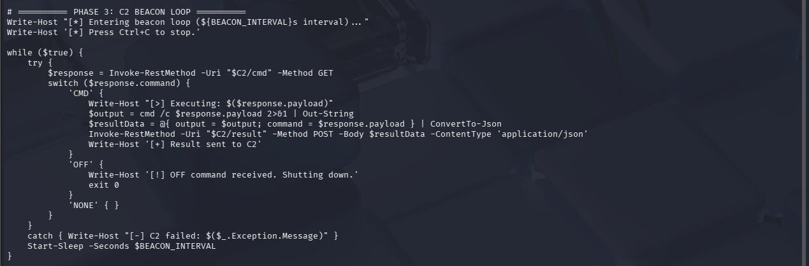

*Figure 16: RAT script continued - persistence mechanism and C2 beacon loop with command execution switch.*

## 6. Attack Chain Walkthrough

### 6.1 Initial Access - FileFix Social Engineering

The attack was initiated by navigating to the FileFix lure page (`http://10.0.20.50/filefix/`) on Goku-mak. Clicking the "I'm not a robot" button triggered the JavaScript clipboard payload and revealed the paste-and-press-Enter instructions to the user.


*Figure 21: FileFix lure page displayed on Goku-mak - victim navigates to the attacker-hosted verification page.*

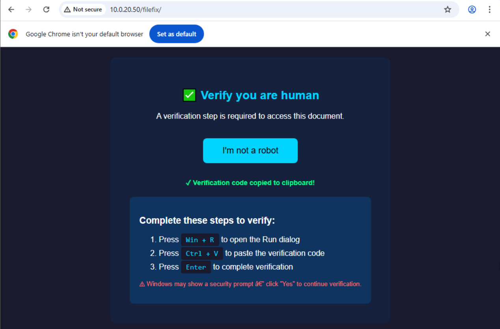

*Figure 22: Social engineering trigger - clicking the button copies the PowerShell command and reveals paste instructions.*

### 6.2 Execution - PowerShell via Run Dialog

Pressing `Win + R`, `Ctrl + V`, and Enter pasted and executed the dropper inside the Run dialog - the canonical FileFix execution path. The dropper successfully downloaded `rat.ps1`, saved it as `wefs.cfg` in the staging directory, established the Registry Run key, and entered the C2 polling loop.

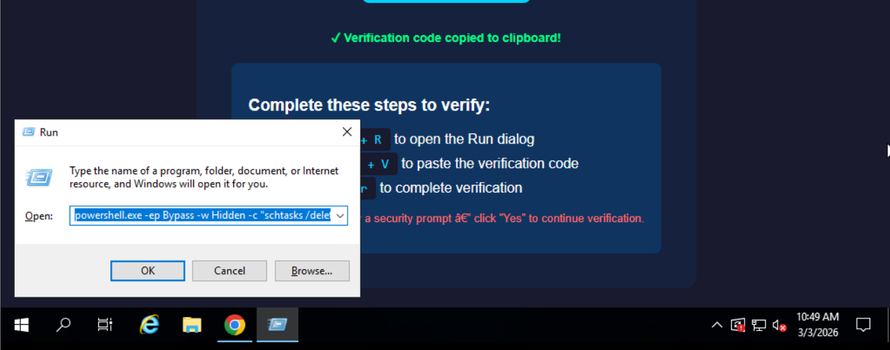

*Figure 23: PowerShell execution via Run dialog - dropper downloads and executes the RAT on the victim machine.*


*Figure 24: C2 server receiving beacon and exfiltration data - automated discovery data exfiltrated within seconds.*

### 6.3 Persistence - HKCU Run Key

The RAT writes the `InterlockSim` value to `HKCU\Software\Microsoft\Windows\CurrentVersion\Run`, pointing to `powershell.exe -ep Bypass -File C:\Users\Gokuadm-mak\AppData\Roaming\php\wefs.cfg`. This is detected at the host layer by Wazuh rule `100003` (level 14, MITRE T1547.001) via Sysmon Event ID 13.

### 6.4 Discovery - Automated Phase 1 + Hands-on-Keyboard

On launch the RAT runs the same discovery commands documented in The DFIR Report - `systeminfo /FO CSV`, `tasklist /svc /FO CSV`, `Get-Service`, `Get-PSDrive -PSProvider FileSystem`, `Get-NetNeighbor` (ARP), and a `WindowsPrincipal` privilege check. The results are converted to JSON and POSTed to `/exfil`. After Phase 1 the operator queued seven hands-on-keyboard commands - `whoami`, `tasklist`, AD computer count via `[adsisearcher]`, `nltest /dclist`, `net user Gokuadm-mak /domain`, `dir AppData\Roaming`, and a Veeam server search - through `/opt/c2/commands/next_cmd.json`.

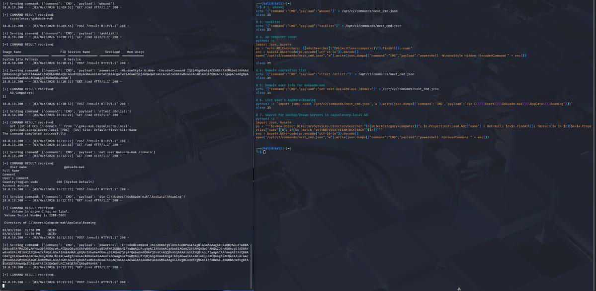

*Figure 29: C2 command results - output from hands-on-keyboard discovery commands executed through the RAT.*

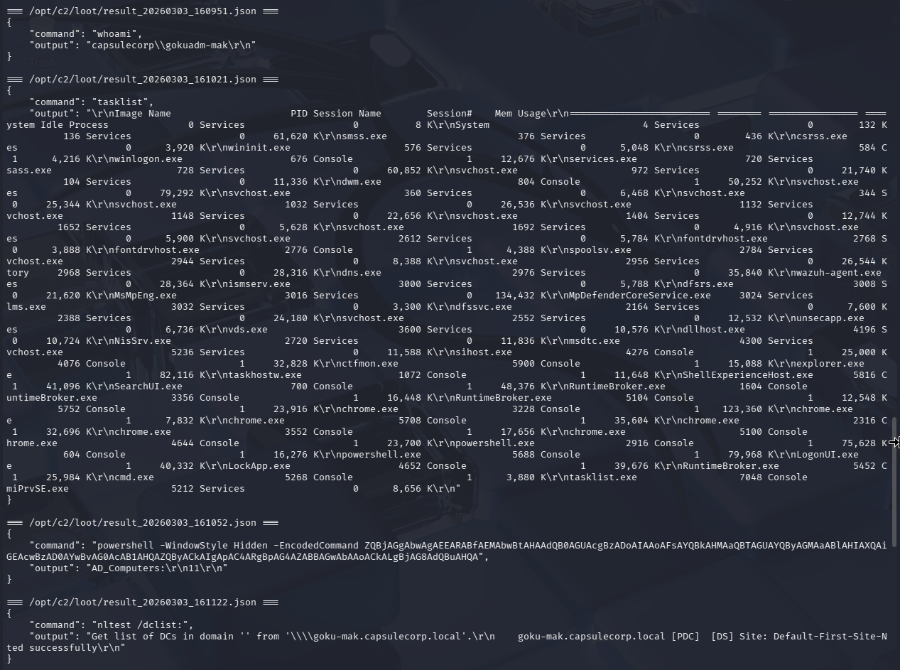

*Figure 30: C2 loot - sample exfiltration JSON content showing the `tasklist` output and other discovery data captured from the victim during Phase 1.*

### 6.5 Lateral Movement - RDP Pivot via netsh portproxy

RDP was first enabled on Krillin-mak by setting `fDenyTSConnections=0`, enabling the Remote Desktop firewall rule group, and disabling Network Level Authentication so the Linux RDP client could connect.

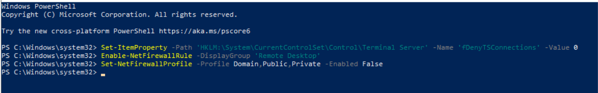

*Figure 31: RDP enabled on Krillin-mak - registry modification, firewall rules, and NLA disabled for third-party RDP clients.*

From an elevated PowerShell session on Goku-mak, the operator configured `netsh interface portproxy add v4tov4 listenport=33890 connectaddress=10.0.10.205 connectport=3389` and opened the firewall, turning the compromised DC into a relay.

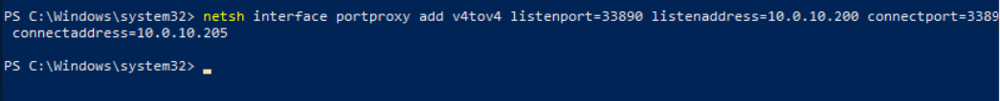

*Figure 32: Port forward configured on Goku-mak - netsh portproxy relaying 33890 to Krillin-mak:3389 with firewall rule.*

Kali then connected via `sdl-freerdp3` to `10.0.10.200:33890`, which was forwarded transparently to Krillin-mak:3389. The ingress leg traversed the router and was detected at the network layer (Suricata SID 1000013); the egress leg stayed inside the victim subnet and was detected at the host layer (Wazuh rule 92657).

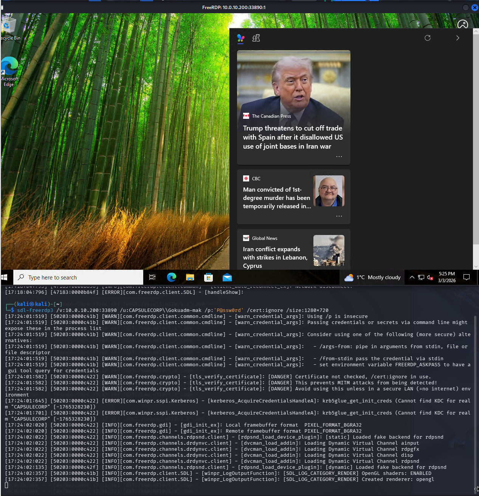

*Figure 33: RDP session established through the pivot - Kali connected to Krillin-mak desktop via Goku-mak port 33890.*

## 7. Detection Engineering

The detection stack is deliberately **layered and independent** - each layer can be reasoned about and validated in isolation, but together they provide overlapping coverage so that a gap in one layer (e.g., intra-subnet RDP that bypasses the network sensor) is closed by another (host-layer logon detection on Krillin-mak).

### 7.1 Suricata IDS/IPS Rules

Nine custom alert signatures cover the network-observable side of the kill chain - PowerShell User-Agent, `.ps1` URI, `/cmd` polling, `/exfil` POST, `/beacon` POST, `/result` POST, generic JSON POST to external, RDP-to-DC, and the RDP-pivot pattern. Three additional DROP rules close the loop in IPS mode. The full ruleset lives in [`detection-rules/suricata/custom.rules`](detection-rules/suricata/custom.rules).

| SID | Action | Coverage | MITRE |
|---|---|---|---|
| 1000001 | alert | PowerShell User-Agent in HTTP | T1059.001 |
| 1000002 | alert | `.ps1` in URI | T1105 |
| 1000003 | alert | `GET /cmd` (C2 poll) | T1071.001 |
| 1000004 | alert | `POST /exfil` | T1041 |
| 1000005 | alert | `POST /beacon` | T1071.001 |
| 1000006 | alert | `POST /result` | T1071.001 |
| 1000008 | alert | JSON POST to external | T1071.001 |
| 1000009 | alert | RDP from DC to workstation | T1021.001 |
| 1000013 | alert | RDP pivot (X.224 mstshash on non-3389) | T1572 |
| 1000010–1000012 | drop | IPS BLOCK: `/cmd`, `/exfil`, PowerShell UA | - |

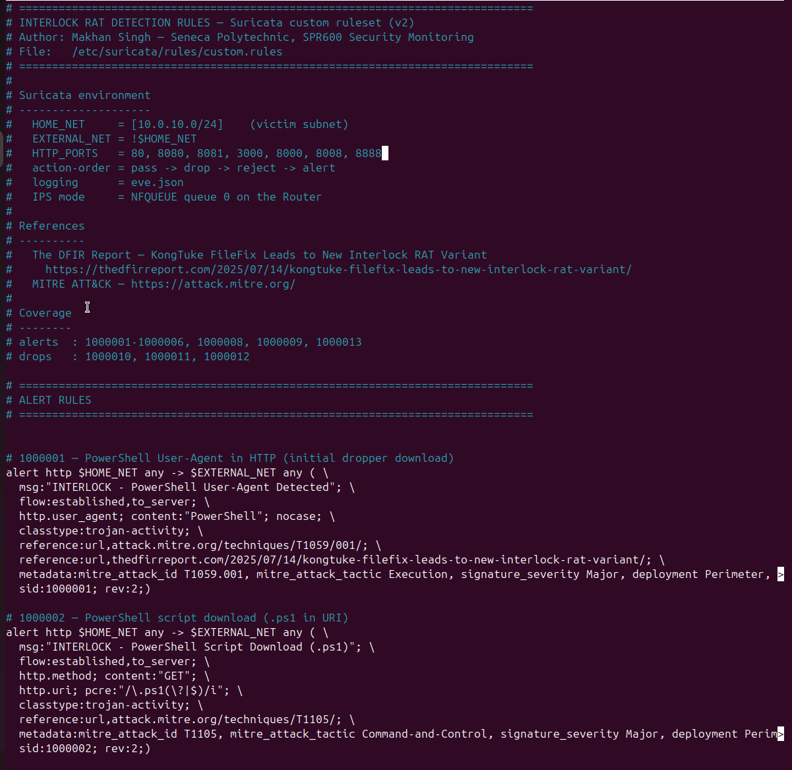

*Figure 17a: Suricata `custom.rules` header - environment metadata, DFIR Report reference, and the first two alert rules (PowerShell User-Agent, `.ps1` download).*

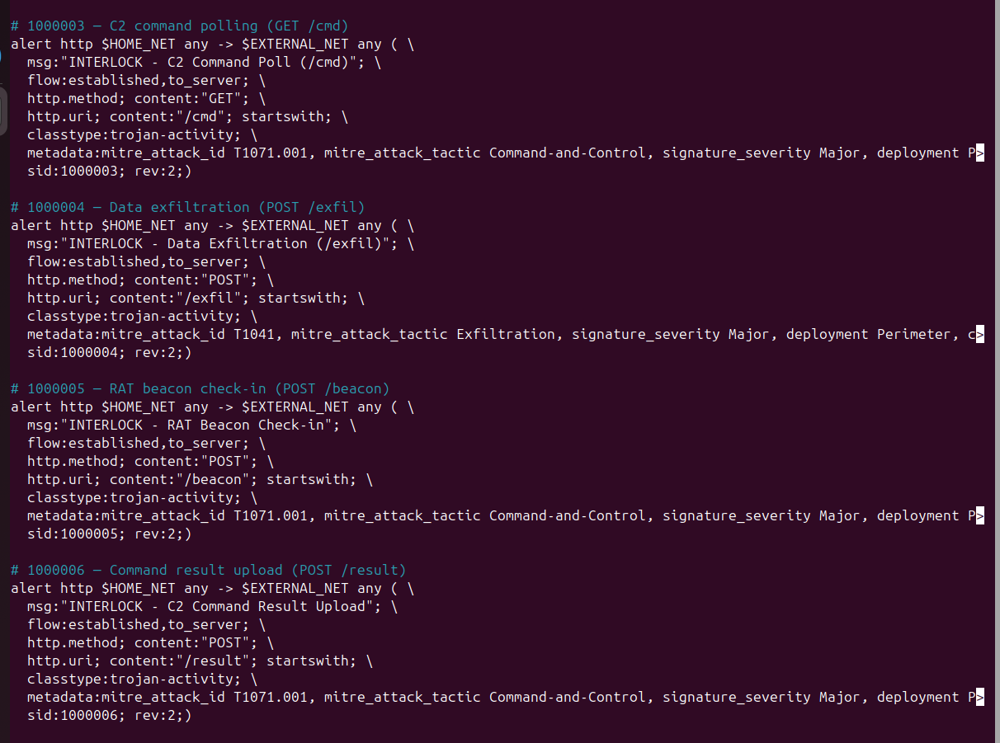

*Figure 17b: Suricata `custom.rules` continued - the four C2-endpoint signatures (1000003 `/cmd`, 1000004 `/exfil`, 1000005 `/beacon`, 1000006 `/result`).*

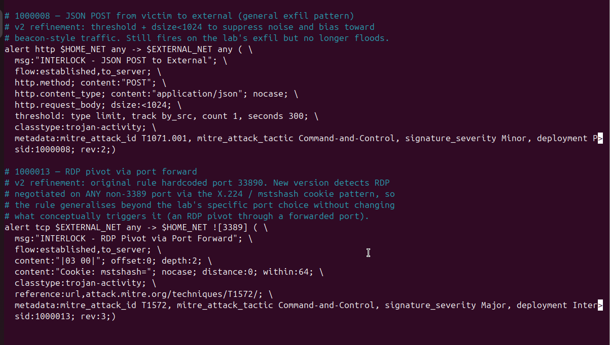

*Figure 17c: Suricata `custom.rules` continued - the generic-JSON-exfil signature (1000008) and the X.224/mstshash RDP-pivot rule (1000013).*

Representative rule (SID 1000001 - PowerShell User-Agent in HTTP, T1059.001):

```suricata
alert http $HOME_NET any -> $EXTERNAL_NET any ( \
  msg:"INTERLOCK - PowerShell User-Agent Detected"; \
  flow:established,to_server; \
  http.user_agent; content:"PowerShell"; nocase; \
  classtype:trojan-activity; \
  reference:url,attack.mitre.org/techniques/T1059/001/; \
  reference:url,thedfirreport.com/2025/07/14/kongtuke-filefix-leads-to-new-interlock-rat-variant/; \
  metadata:mitre_attack_id T1059.001, mitre_attack_tactic Execution, signature_severity Major, deployment Perimeter, confidence High; \
  sid:1000001; rev:2;)
```

```bash
# Validate config and reload rules without restarting
sudo suricata -T -c /etc/suricata/suricata.yaml -v 2>&1 | tail -5
sudo suricatasc -c reload-rules
sudo suricatasc -c ruleset-stats
```

### 7.2 Zeek NSM Notice Types

The Zeek script [`detection-rules/zeek/interlock-detect.zeek`](detection-rules/zeek/interlock-detect.zeek) raises six custom `Notice::Type` values from `http_request` events, providing protocol-aware metadata that complements Suricata's signature-based detection.

| Notice Type | Trigger | MITRE |
|---|---|---|
| `Interlock_C2_Beacon` | `GET` request with `/cmd` in URI | T1071.001 |
| `Interlock_Data_Exfil` | `POST` request with `/exfil` in URI | T1041 |
| `Interlock_PS_Download` | Any URI containing `.ps1` | T1105 |
| `Interlock_PowerShell_UA` | `User-Agent` header containing `PowerShell` | T1059.001 |
| `Interlock_Lab_C2_Beacon_Post` | `POST` request with `/beacon` in URI | T1071.001 |
| `Interlock_Lab_C2_Result` | `POST` request with `/result` in URI | T1071.001 |

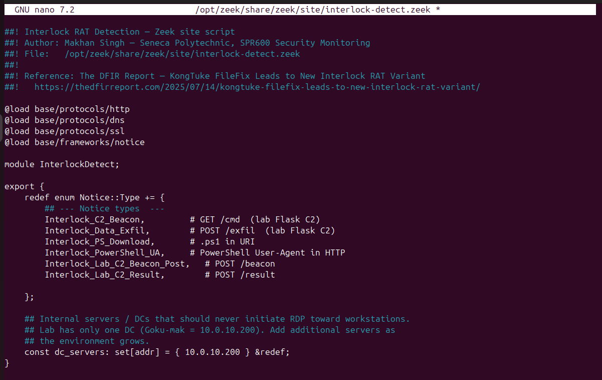

*Figure 18a: Zeek `interlock-detect.zeek` - module declaration, the six custom `Notice::Type` values, and the `dc_servers` constant used by the RDP detection.*

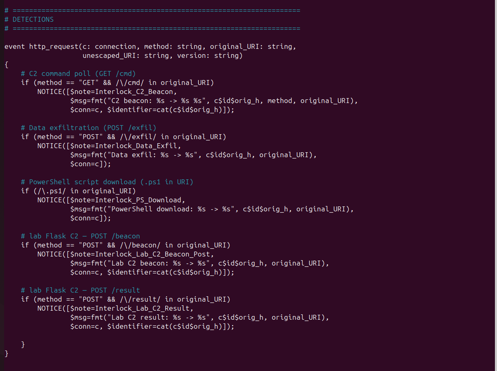

*Figure 18b: Zeek `interlock-detect.zeek` event handler - the `http_request` block raising a NOTICE for each of the six Interlock-specific traffic patterns.*

```zeek
event http_request(c: connection, method: string, original_URI: string,
                   unescaped_URI: string, version: string)
{
    # C2 command poll (GET /cmd)
    if (method == "GET" && /\/cmd/ in original_URI)
        NOTICE([$note=Interlock_C2_Beacon,
                $msg=fmt("C2 beacon: %s -> %s %s", c$id$orig_h, method, original_URI),
                $conn=c, $identifier=cat(c$id$orig_h)]);

    # Data exfiltration (POST /exfil)
    if (method == "POST" && /\/exfil/ in original_URI)
        NOTICE([$note=Interlock_Data_Exfil,
                $msg=fmt("Data exfil: %s -> %s", c$id$orig_h, original_URI),
                $conn=c]);

    # PowerShell script download (.ps1 in URI)
    if (/\.ps1/ in original_URI)
        NOTICE([$note=Interlock_PS_Download,
                $msg=fmt("PowerShell download: %s -> %s", c$id$orig_h, original_URI),
                $conn=c]);

    # Lab Flask C2 - POST /beacon
    if (method == "POST" && /\/beacon/ in original_URI)
        NOTICE([$note=Interlock_Lab_C2_Beacon_Post,
                $msg=fmt("Lab C2 beacon: %s -> %s", c$id$orig_h, original_URI),
                $conn=c, $identifier=cat(c$id$orig_h)]);

    # Lab Flask C2 - POST /result
    if (method == "POST" && /\/result/ in original_URI)
        NOTICE([$note=Interlock_Lab_C2_Result,
                $msg=fmt("Lab C2 result: %s -> %s", c$id$orig_h, original_URI),
                $conn=c, $identifier=cat(c$id$orig_h)]);
}
```

### 7.3 Wazuh HIDS Rules

Eight custom Wazuh rules in [`detection-rules/wazuh/local_rules.xml`](detection-rules/wazuh/local_rules.xml) target Sysmon-derived host events. Rules 100001–100006 cover the documented Interlock behaviours; rules 100008 and 100009 add hardening detections for encoded-PowerShell obfuscation and the FileFix paste-and-run parent-process pattern.

| Rule ID | Level | Description | MITRE |
|---|---|---|---|
| 100001 | 12 | PowerShell with Bypass execution policy | T1059.001 |
| 100002 | 12 | File created in `AppData\Roaming\php` (RAT staging) | T1105 |
| 100003 | 14 | Registry Run key modified (persistence) | T1547.001 |
| 100004 | 10 | Discovery command with JSON exfil pattern | T1082 |
| 100005 | 12 | Active Directory enumeration | T1018 |
| 100006 | 10 | `schtasks /delete /tn Updater` (dropper cleanup) | T1053.005 |
| 100008 | 14 | PowerShell `-EncodedCommand` with base64 payload | T1059.001 / T1027 |
| 100009 | 13 | `explorer.exe` spawning PowerShell with downloader (FileFix paste-and-run) | T1566.001 / T1059.001 / T1204.002 |

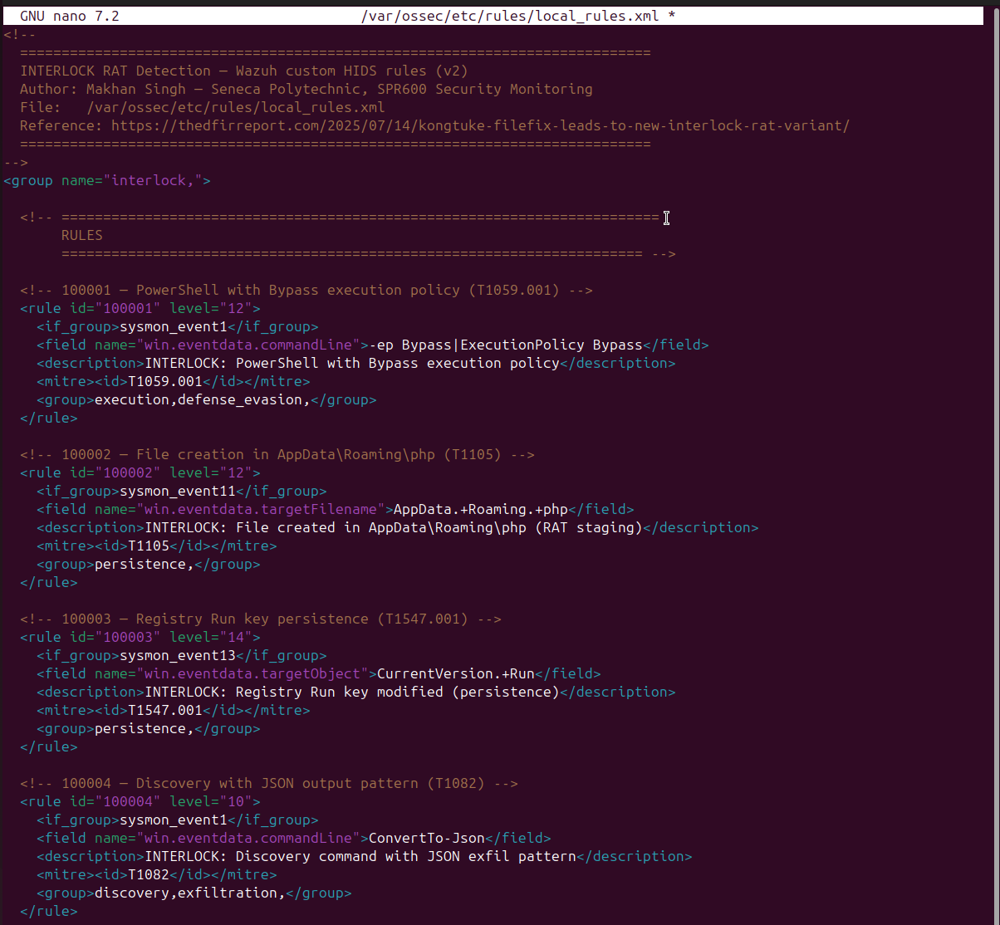

*Figure 19: Wazuh `local_rules.xml` - rules 100001–100004 with their MITRE ATT&CK technique mappings.*

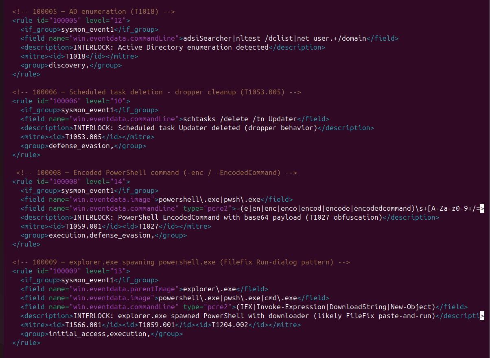

*Figure 20: Wazuh `local_rules.xml` continued - rules 100005 (AD enumeration), 100006 (scheduled-task cleanup), 100008 (encoded PowerShell), and 100009 (FileFix paste-and-run).*

Representative rule (100003 - Registry Run-key persistence, level 14):

```xml
<rule id="100003" level="14">
  <if_group>sysmon_event13</if_group>
  <field name="win.eventdata.targetObject">CurrentVersion.+Run</field>
  <description>INTERLOCK: Registry Run key modified (persistence)</description>
  <mitre><id>T1547.001</id></mitre>
  <group>persistence,</group>
</rule>
```

Hardening rule (100009 - explorer.exe spawning PowerShell with a downloader, the canonical FileFix paste-and-run pattern):

```xml
<rule id="100009" level="13">
  <if_group>sysmon_event1</if_group>
  <field name="win.eventdata.parentImage">explorer\.exe</field>
  <field name="win.eventdata.image">powershell\.exe|pwsh\.exe|cmd\.exe</field>
  <field name="win.eventdata.commandLine" type="pcre2">(IEX|Invoke-Expression|DownloadString|New-Object)</field>
  <description>INTERLOCK: explorer.exe spawned PowerShell with downloader (likely FileFix paste-and-run)</description>
  <mitre><id>T1566.001</id><id>T1059.001</id><id>T1204.002</id></mitre>
  <group>initial_access,execution,</group>
</rule>
```

### 7.4 Consolidated Detection Matrix

| Phase | Suricata SID | Zeek Notice | Wazuh Rule | MITRE |
|---|---|---|---|---|
| PowerShell Download | 1000001, 1000002 | `Interlock_PS_Download`, `Interlock_PowerShell_UA` | 100001 | T1059.001 |
| C2 Beacon | 1000003, 1000005 | `Interlock_C2_Beacon` | 86601 (forwarded) | T1071.001 |
| Data Exfiltration | 1000004, 1000008 | `Interlock_Data_Exfil` | 100004 | T1041 / T1082 |
| Persistence | - | - | 100003 (level 14) | T1547.001 |
| AD Enumeration | - | - | 100005 | T1018 |
| Scheduled Task Cleanup | - | - | 100006 | T1053.005 |
| RDP Lateral Movement | 1000009, 1000013 | `conn.log` | 60106, 92657 | T1021.001 / T1572 |
| IPS Block | 1000010–1000012 | - | 86601 (BLOCK) | - |

## 8. Live Detection Output

All three detection layers fired simultaneously during attack execution, confirming comprehensive coverage of the kill chain.

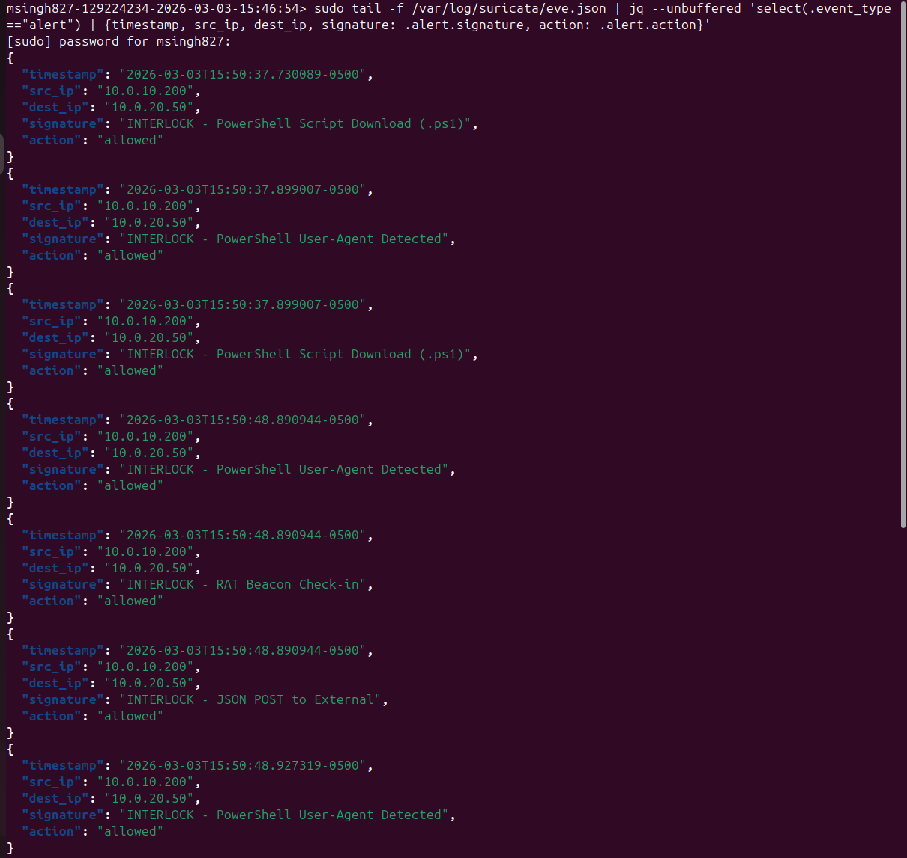

*Figure 25: Suricata alerts (Terminal 1) - real-time JSON alerts showing PowerShell User-Agent, Script Download, Beacon.*

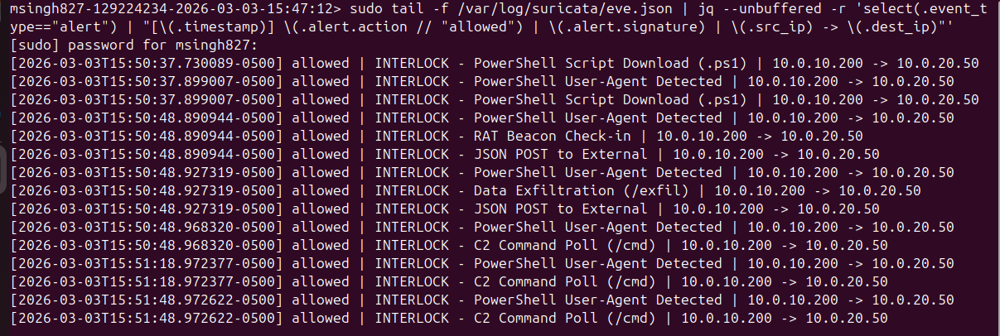

*Figure 26: Suricata compact view (Terminal 2) - one-line alert format showing signature names, actions, and source/destination.*

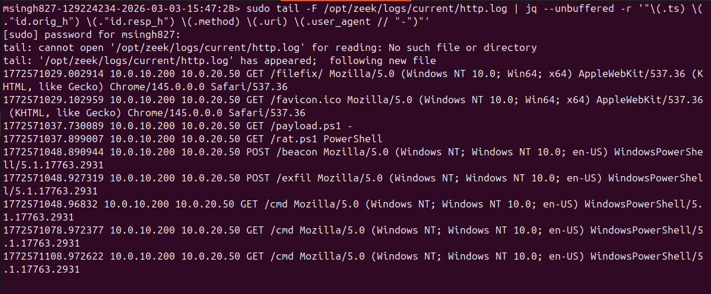

*Figure 27: Zeek HTTP log (Terminal 3) - HTTP transactions to C2 including payload.ps1 download, beacon POST, and exfil POSTs.*

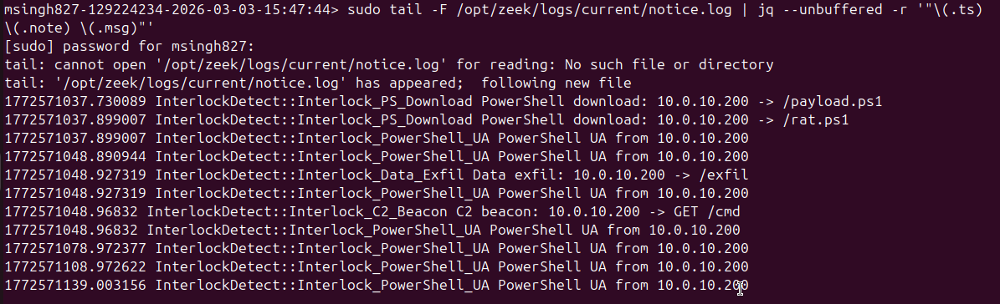

*Figure 28: Zeek notice log (Terminal 4) - custom InterlockDetect notices firing for PowerShell download and User-Agent.*

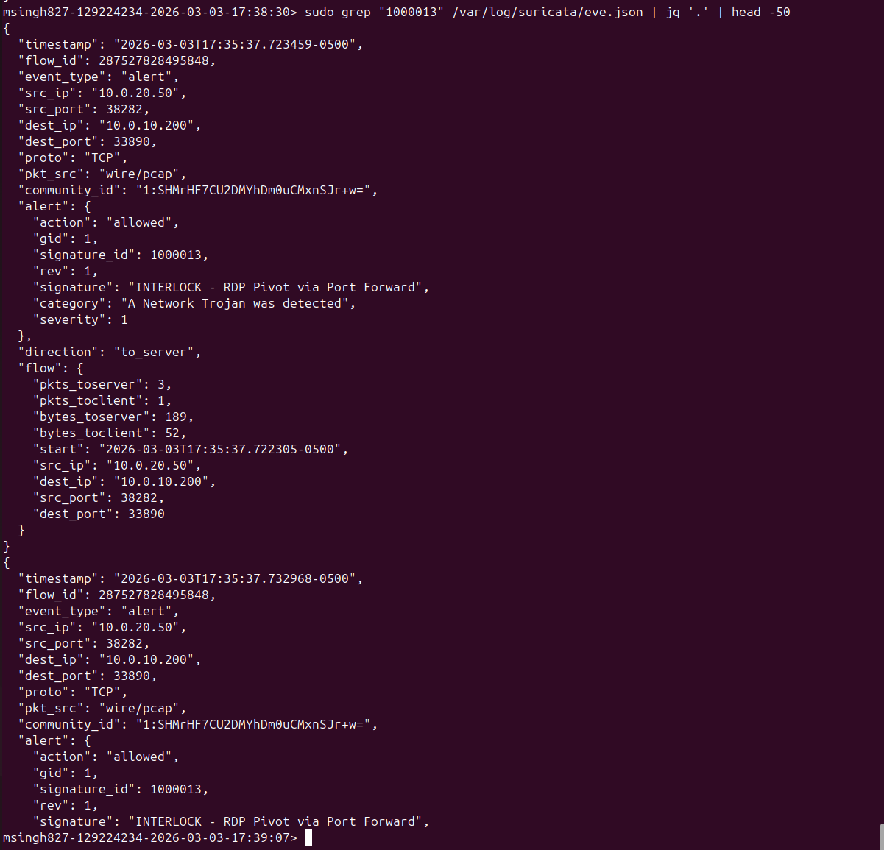

*Figure 34: Suricata SID 1000013 - RDP Pivot via Port Forward alert firing for traffic from 10.0.20.50 to 10.0.10.200:33890.*

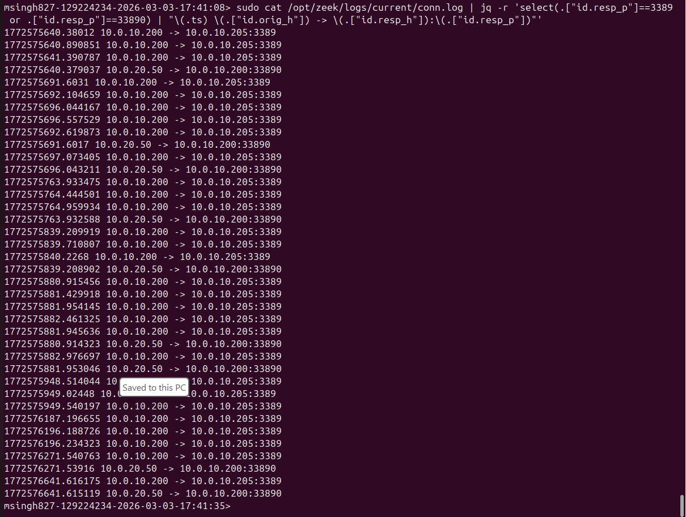

*Figure 35: Zeek conn.log - both pivot legs visible: 10.0.20.50→10.0.10.200:33890 and 10.0.10.200→10.0.10.205:3389.*

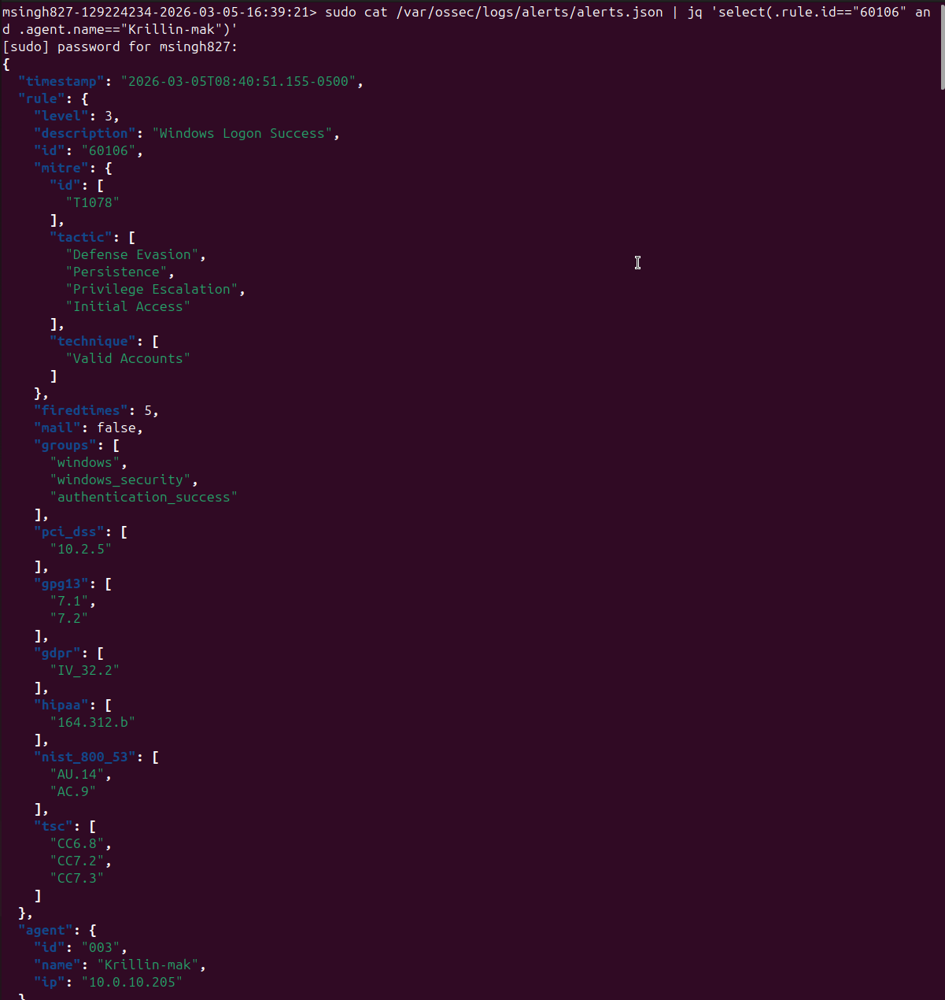

*Figure 36: Wazuh Event 4624 - Windows Logon Success on Krillin-mak agent confirming network logon (Type 3).*

## 9. Automated Detection & Response

Detection without automated response is incomplete. This project closes the loop in three places - Suricata IPS DROP rules at the network edge, a Wazuh `firewall-drop` active response at the SIEM, and a real-time Bash daemon for analyst visibility.

### 9.1 Suricata IPS DROP Rules

Three DROP rules (SIDs 1000010–1000012) appended to [`custom.rules`](detection-rules/suricata/custom.rules) target the C2 command poll, exfiltration POSTs, and any HTTP request carrying a `PowerShell` User-Agent. Suricata's action-order is `pass → drop → reject → alert`, so DROP rules take priority over the matching ALERT rules - the EVE log shows `event_type: alert` with `action: blocked` for matched traffic. With these rules active, the kill chain breaks at the Delivery phase: the dropper cannot fetch `payload.ps1`.

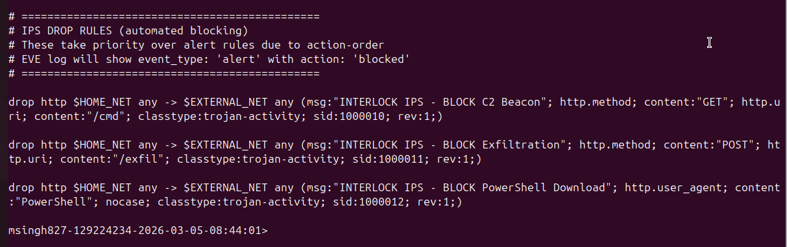

*Figure 37: DROP rules added to custom.rules - three IPS rules targeting C2 beacon, exfiltration, and PowerShell download.*

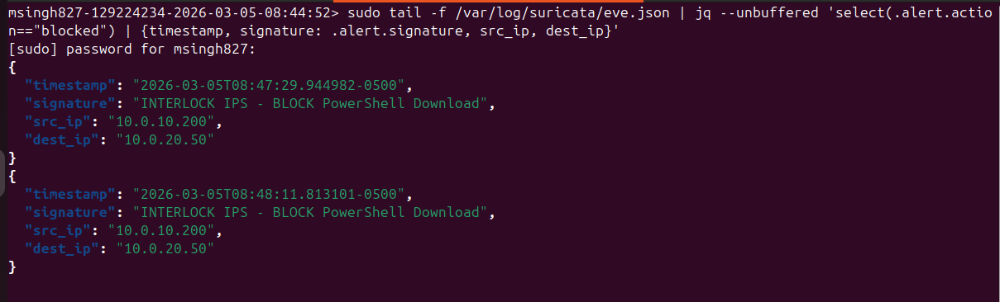

*Figure 38: IPS blocking in action - Suricata eve.json showing action:blocked for INTERLOCK IPS - BLOCK PowerShell Download.*

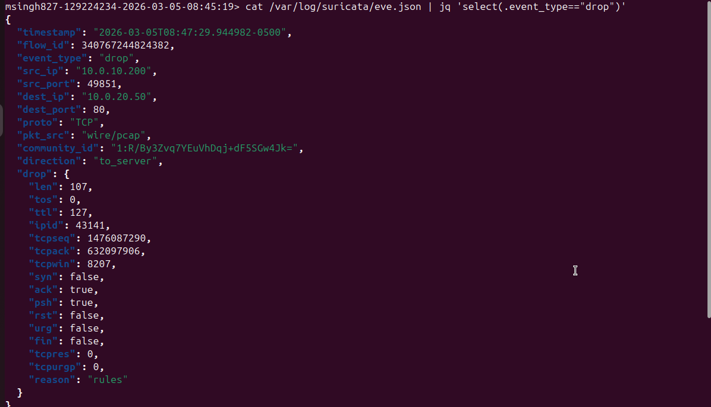

*Figure 39: Drop event detail - packet dropped with reason:rules, confirming Suricata actively blocked the traffic.*

```bash
# Watch blocked events
sudo tail -f /var/log/suricata/eve.json | \
  jq --unbuffered 'select(.alert.action=="blocked") |
    {timestamp, signature: .alert.signature, src_ip, dest_ip}'
```

### 9.2 Wazuh Active Response

The active-response block in [`detection-rules/wazuh/ossec.conf.snippet`](detection-rules/wazuh/ossec.conf.snippet) wires the built-in `firewall-drop` command to rules 100001 (PowerShell Bypass) and 100003 (Registry Run-key persistence) with a 600-second timeout. When either rule fires, Wazuh executes a local iptables/nftables drop of the offending source IP - a host-driven complement to the network-driven Suricata DROP rules.

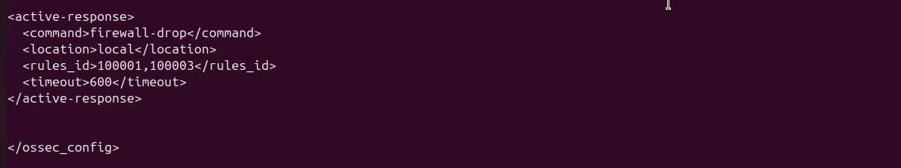

*Figure 40: Wazuh active response configuration - firewall-drop command linked to rules 100001 and 100003 with 600s timeout.*

```xml
<active-response>
  <command>firewall-drop</command>
  <location>local</location>
  <rules_id>100001,100003</rules_id>
  <timeout>600</timeout>
</active-response>
```

### 9.3 Real-Time Alert Monitor

[`automation/alert_monitor.sh`](automation/alert_monitor.sh) tails Suricata's `eve.json`, filters for `INTERLOCK` signatures, formats `[allowed]` vs `[blocked]` events one-per-line, and tees the stream to `/var/log/interlock-alerts.log` for after-action review. It runs as a backgrounded daemon (`bash /opt/scripts/alert_monitor.sh &`) on the Router.

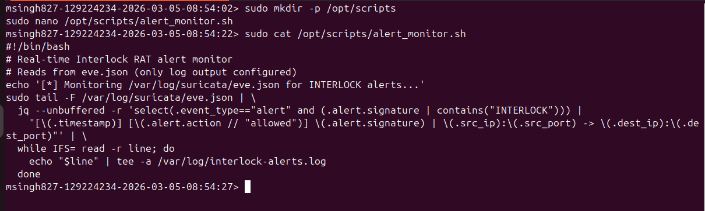

*Figure 41: Alert monitoring script (alert_monitor.sh) - Bash script parsing eve.json for INTERLOCK alerts with action labeling.*

![Figure 42: Alert monitor output - real-time display showing both [allowed] and [blocked] events from the IPS test](images/fig42-alert-monitor-output.png)

*Figure 42: Alert monitor output - real-time display showing both [allowed] and [blocked] events from the IPS test.*

```bash
sudo tail -F /var/log/suricata/eve.json | \
  jq --unbuffered -r 'select(.event_type=="alert" and (.alert.signature | contains("INTERLOCK"))) |
    "[\(.timestamp)] [\(.alert.action // "allowed")] \(.alert.signature) | \(.src_ip):\(.src_port) -> \(.dest_ip):\(.dest_port)"' | \
  while IFS= read -r line; do
    echo "$line" | tee -a /var/log/interlock-alerts.log
  done
```

## 10. Post-Attack Forensic Analysis

A comprehensive extraction of all Suricata, Zeek, and Wazuh telemetry confirmed that every custom signature, notice, and rule generated hits across the attack chain.

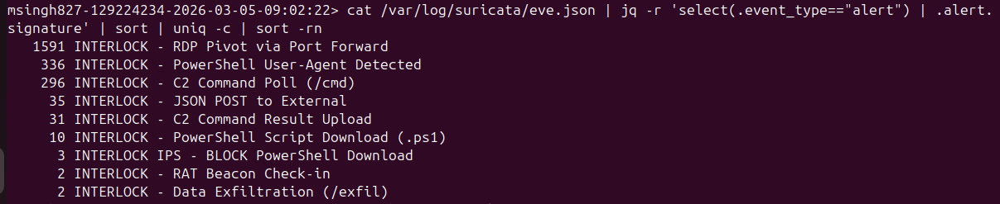

*Figure 43: Suricata alert summary - count by signature showing all nine custom rules fired with expected frequencies.*

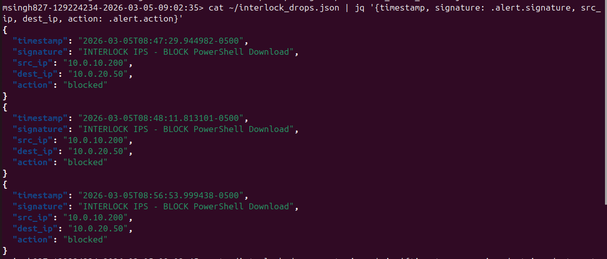

*Figure 44: Suricata IPS DROP events - extracted from `~/interlock_drops.json` showing three `action: blocked` PowerShell-download attempts (10.0.10.200 → 10.0.20.50) on March 5th.*

Zeek logs were extracted from the archived `2026-03-03` directory (logs are rotated and gzipped daily). The HTTP log captured every payload download and C2 transaction, and the notice log captured every custom InterlockDetect firing.

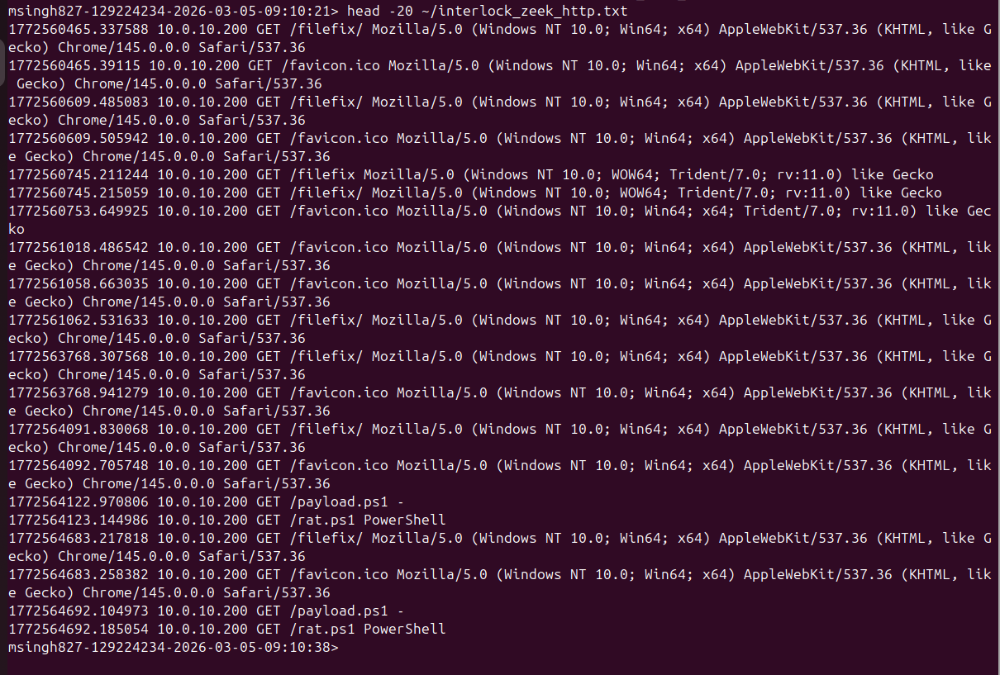

*Figure 45: Zeek HTTP log - FileFix lure visits and payload downloads with full User-Agent strings captured.*

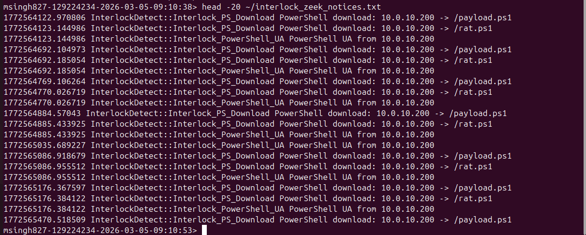

*Figure 46: Zeek notices - custom InterlockDetect script firing Interlock_PS_Download and Interlock_PowerShell_UA notices.*

Wazuh alert extraction confirmed custom rule 100001 fired for PowerShell Bypass execution on the Gokuadm-mak agent with MITRE ATT&CK mapping to T1059.001.

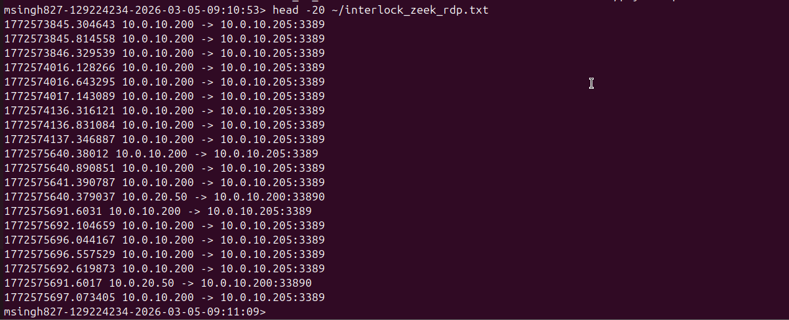

*Figure 47: Zeek RDP log extraction (`~/interlock_zeek_rdp.txt`) - both pivot legs visible: `10.0.10.200 → 10.0.10.205:3389` (egress on the victim subnet) and `10.0.20.50 → 10.0.10.200:33890` (ingress through the Router).*

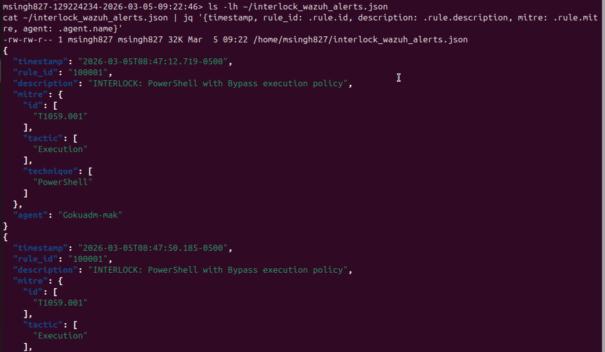

*Figure 48: Wazuh custom rule 100001 details - JSON event from `interlock_wazuh_alerts.json` showing `rule_id: "100001"`, MITRE technique `T1059.001` (PowerShell), tactic Execution, and agent `Gokuadm-mak`.*

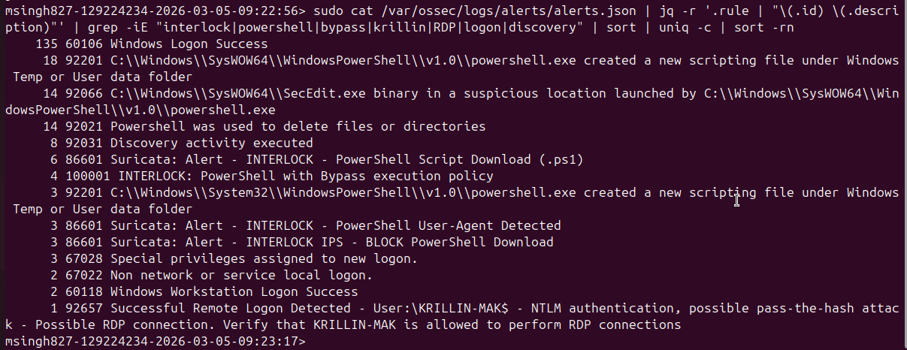

*Figure 49: Wazuh comprehensive alert summary - all attack-related rules showing detection across PowerShell, discovery, and RDP.*

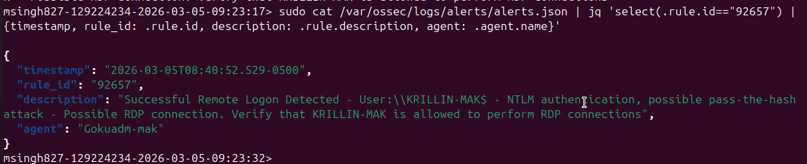

*Figure 50: Wazuh built-in rule 92657 - `Successful Remote Logon Detected - User:\\KRILLIN-MAK$ - NTLM authentication, possible pass-the-hash attack - Possible RDP connection.` This is the host-side correlation that closes the network-layer gap on intra-subnet RDP.*

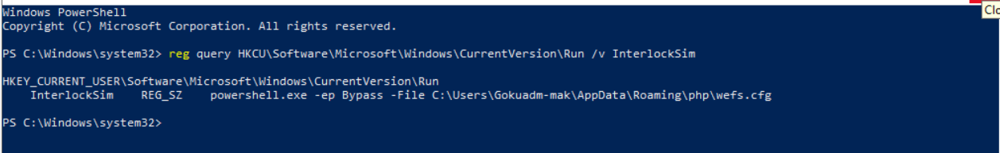

*Figure 51: Registry persistence - `reg query` confirms the `InterlockSim` value under `HKCU\…\Run` pointing to `powershell.exe -ep Bypass -File C:\Users\Gokuadm-mak\AppData\Roaming\php\wefs.cfg`.*

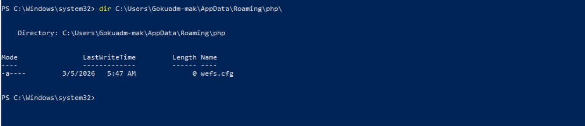

*Figure 52: RAT staging directory on Goku-mak - `dir C:\Users\Gokuadm-mak\AppData\Roaming\php\` confirms `wefs.cfg` (the renamed `rat.ps1`) was successfully dropped during execution.*

## 11. Wazuh SIEM Dashboard

A custom **INTERLOCK RAT - Threat Hunting Dashboard** consolidates 10 purpose-built visualizations over the unified `wazuh-alerts-*` index. Each visualization captures one analytical question (alert mix, attack timeline, MITRE technique coverage, IPS effectiveness, agent distribution, PowerShell activity, RDP/logon correlation, severity pyramid, Suricata signature hits, discovery activity). The dashboard is reachable at `https://10.0.10.1` from any host on the victim subnet.

### 11.1 Log Ingestion Architecture

The Wazuh manager on the Router (10.0.10.1) correlates three independent telemetry streams into a single index. The C2 loot collected on the Kali side (Figure 53) plus the alert pipeline in Figures 54–56 give the full picture of what reached the SIEM during the attack.

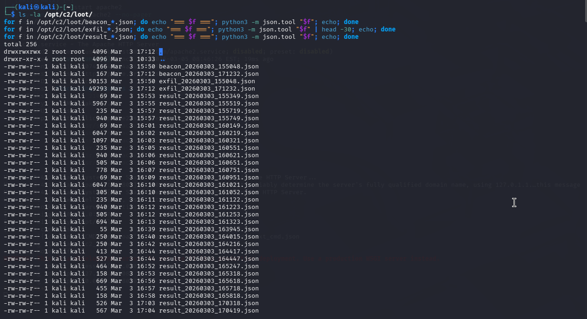

*Figure 53: C2 loot directory listing - `ls /opt/c2/loot/` showing the full set of beacon, exfil, and command-result JSON files captured during the attack session.*

| Source | Agent / Method | Log Types | Key Detections |
|---|---|---|---|
| Goku-mak (DC, 10.0.10.200, Agent ID 004) | Wazuh Agent + Sysmon (SwiftOnSecurity config) | Sysmon Event 1 (process), 11 (file), 13 (registry); Windows Security | Custom rule 100001 (PowerShell Bypass), 92031 (Discovery), 92021 (PS file deletion) |
| Krillin-mak (Workstation, 10.0.10.205, Agent ID 003) | Wazuh Agent | Windows Security Event 4624 (Logon Success) | Built-in 60106 (Logon Success), 92657 (Remote Logon / possible pass-the-hash) |
| Router (Suricata) | Local `eve.json` integration | Suricata alerts, drops, HTTP metadata | Wazuh rule 86601 carrying all 9 custom Suricata SIDs and IPS-blocked events |

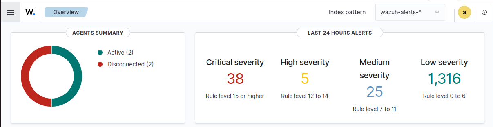

*Figure 54: Wazuh dashboard overview - agents-summary donut (2 active, 2 disconnected) and last-24-hours alert severity counts (38 critical, 5 high, 25 medium, 1,316 low).*

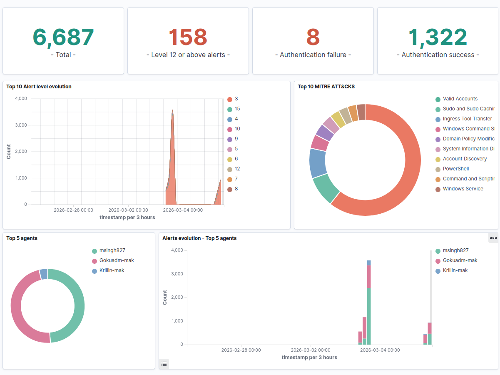

*Figure 55: Wazuh main dashboard - total alerts 6,687 with 158 at level 12+, the Top 10 MITRE ATT&CK techniques donut (Valid Accounts dominant), the alert-level-evolution timeline, and Top 5 agents (msingh827, Gokuadm-mak, Krillin-mak).*

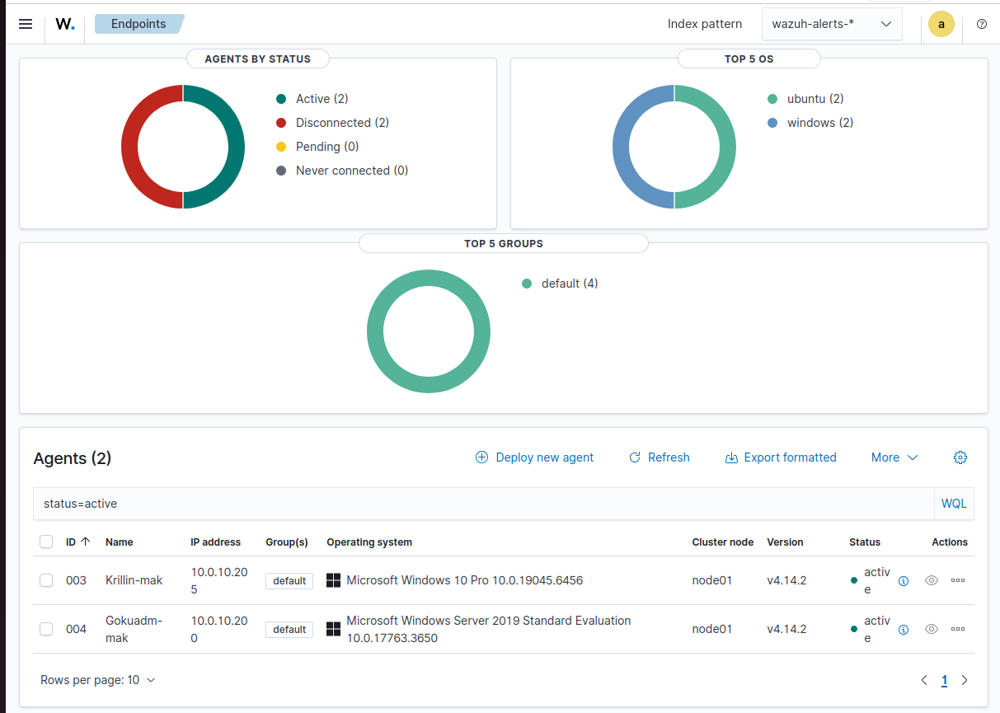

*Figure 56: Wazuh Endpoints view - two active Wazuh agents (`003 Krillin-mak` on Windows 10 Pro at 10.0.10.205, `004 Gokuadm-mak` on Windows Server 2019 at 10.0.10.200), both running Wazuh agent v4.14.2.*

### 11.2 Visualization 1 - INTERLOCK Alert Distribution (Donut)

**Type:** Donut Pie Chart · **Field:** `rule.description` (Terms, size 15) · **Filter:** `rule.id: "100001" OR "92657" OR "92031" OR "86601" OR "92021" OR "92201"`

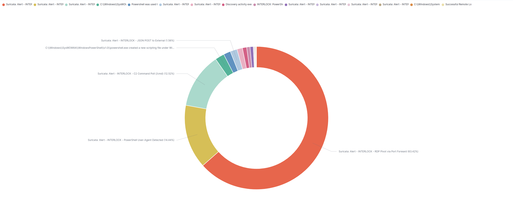

*Figure 57: Visualization 1 - INTERLOCK Alert Distribution.*

**Analytical finding.** Network-layer detection (Suricata via Wazuh rule 86601) provides the highest alert volume, while endpoint detection (Sysmon/Wazuh) provides higher-fidelity, lower-volume alerts with direct MITRE context. A mature SOC would use the Suricata stream for trend analysis and the endpoint alerts for incident confirmation and triage prioritization.

### 11.3 Visualization 2 - INTERLOCK Attack Timeline (Line Chart)

**Type:** Line Chart with Date Histogram (minute interval) · **Filter:** `rule.groups: "sysmon" OR rule.description: "INTERLOCK*" OR rule.id: "86601"`

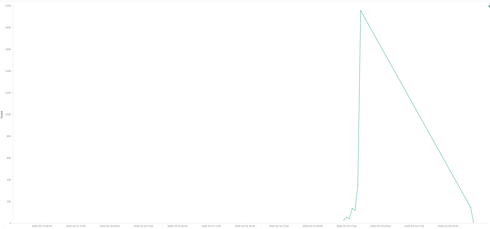

*Figure 58: Visualization 2 - INTERLOCK Attack Timeline.*

**Analytical finding.** The chart cleanly delineates the attack window from baseline operations, allowing an analyst to time-bound an incident investigation. The sharp onset (zero to thousands of alerts in minutes) is characteristic of automated malware execution rather than gradual reconnaissance - consistent with the RAT's automated Phase 1 discovery firing immediately on launch.

### 11.4 Visualization 3 - MITRE ATT&CK Techniques (Horizontal Bar)

**Type:** Horizontal Bar Chart · **Field:** `rule.mitre.technique` (Terms, size 10)

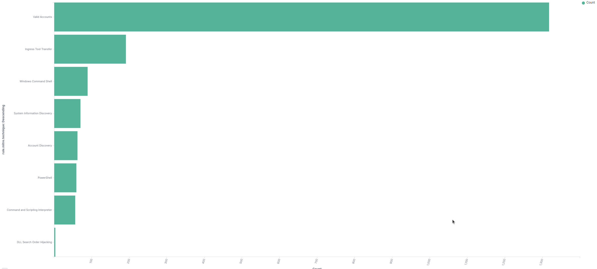

*Figure 59: Visualization 3 - MITRE ATT&CK Techniques.*

**Analytical finding.** Coverage spans five MITRE tactics - Initial Access, Execution, Discovery, Lateral Movement, and Command and Control. Exfiltration (T1041) and Persistence (T1547.001) were detected at the network and host layers but were not surfaced here because the corresponding Wazuh rules lacked `<mitre>` tags; adding those tags is the next iteration's improvement.

### 11.5 Visualization 4 - Suricata IPS Actions (Donut)

**Type:** Donut Pie Chart · **Field:** `data.alert.action` · **Filter:** `rule.id: "86601"`

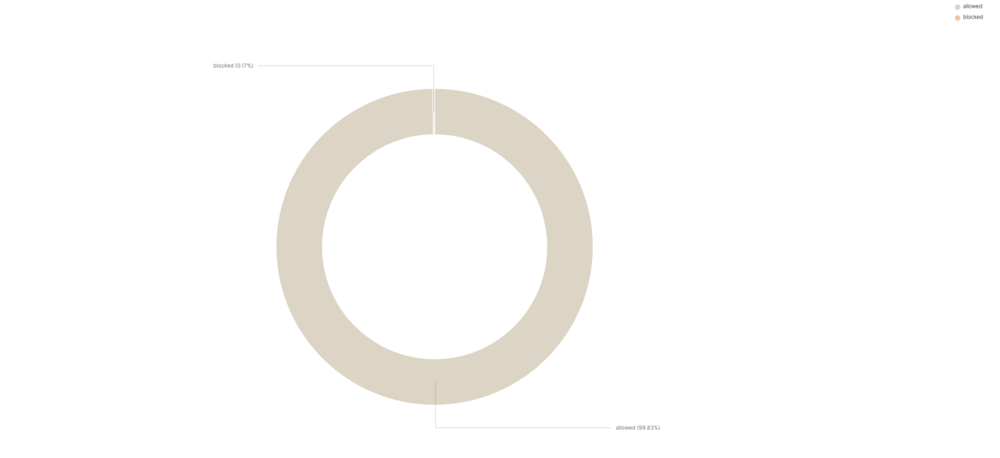

*Figure 60: Visualization 4 - Suricata IPS Blocked vs Allowed.*

**Analytical finding.** Before-and-after evidence that the IPS automation works. With DROP rules active on March 5th, Suricata blocked the PowerShell download (SID 1000012) at the Delivery phase, preventing the entire kill chain from progressing - no beacon, no exfil, no discovery, no lateral movement. This is the case for transitioning validated IDS signatures into IPS mode.

### 11.6 Visualization 5 - Alerts by Agent (Donut)

**Type:** Donut Pie Chart · **Field:** `agent.name` (Terms, size 5)

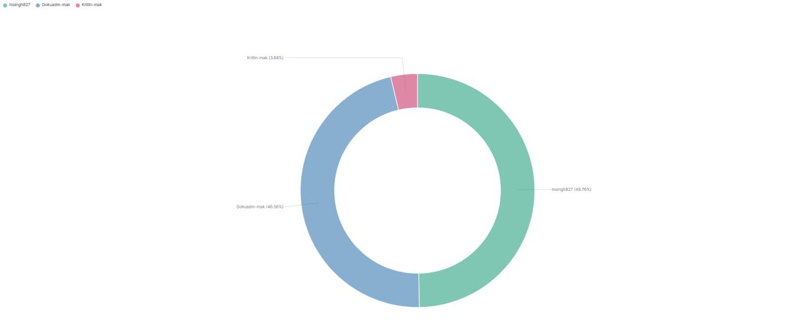

*Figure 61: Visualization 5 - Alerts by Agent.*

**Analytical finding.** The three-agent split confirms that the architecture provides simultaneous visibility at both the network perimeter (Router/Suricata) and the endpoint level (Wazuh agents on Goku-mak and Krillin-mak). The Krillin-mak slice specifically validates that the lateral-movement target was reporting throughout the RDP pivot.

### 11.7 Visualization 6 - PowerShell & Attack Activity (Data Table)

**Type:** Data Table · **Field:** `rule.description` (Terms, size 10)

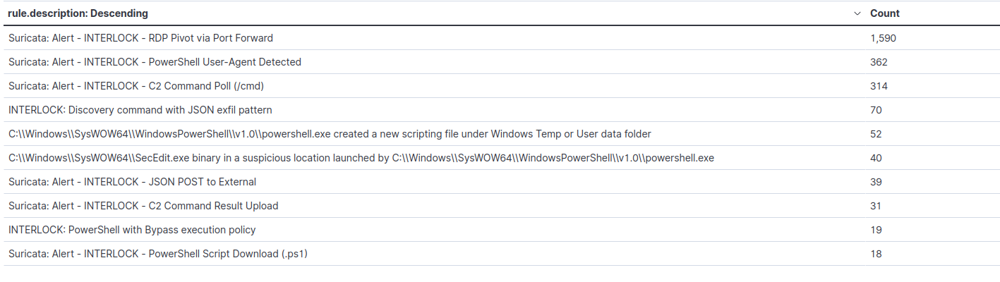

*Figure 62: Visualization 6 - PowerShell and Attack Activity.*

**Analytical finding.** The C2 Command Poll (314) to Command Result Upload (31) ratio is roughly 10:1, consistent with seven hands-on-keyboard commands queued across two attack sessions - most beacon polls returned `NONE` because the operator had not queued a new command. The PowerShell Script Download count (18) aligns with multiple attack re-executions during testing and IPS validation.

### 11.8 Visualization 7 - RDP & Logon Activity (Dual-Split Data Table)

**Type:** Data Table with dual split rows · **Fields:** `rule.description` (primary), `agent.name` (secondary)

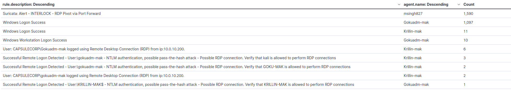

*Figure 63: Visualization 7 - RDP and Logon Activity.*

**Analytical finding.** The agent-name correlation is the value of this view. Without it, a Type 3 logon on Krillin-mak could be dismissed as ordinary domain traffic. The combination of rule 92657 pass-the-hash warnings, the `CAPSULECORP\Gokuadm-mak` username, an explicit source IP of 10.0.10.200, and temporal correlation with the Suricata RDP Pivot alerts produces a high-confidence finding of attacker-initiated lateral movement from the DC.

### 11.9 Visualization 8 - Alert Severity Distribution (Vertical Bar)

**Type:** Vertical Bar Chart · **Field:** `rule.level` (Terms, ascending, size 15)

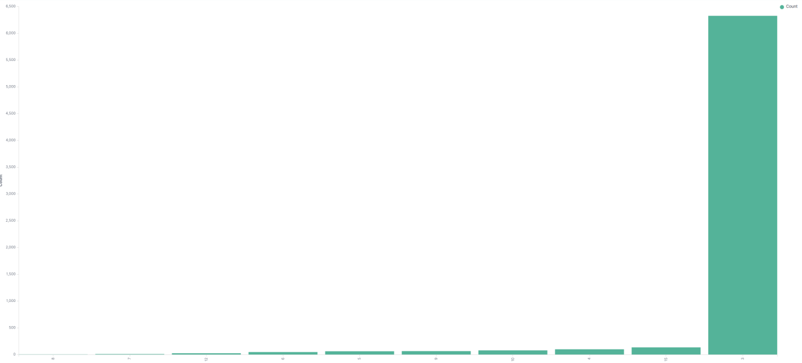

*Figure 64: Visualization 8 - Alert Severity Distribution.*

**Analytical finding.** The pyramid validates rule-level assignment: the custom INTERLOCK rules at levels 10–14 are appropriately elevated above baseline informational events at level 3, ensuring they surface in an analyst's triage queue. A production deployment would filter `rule.level >= 10` to reduce 6,000+ events to a manageable investigation set.

### 11.10 Visualization 9 - Suricata Signature Hits (Horizontal Bar)

**Type:** Horizontal Bar Chart · **Field:** `data.alert.signature` (Terms, size 10) · **Filter:** `rule.id: "86601"`

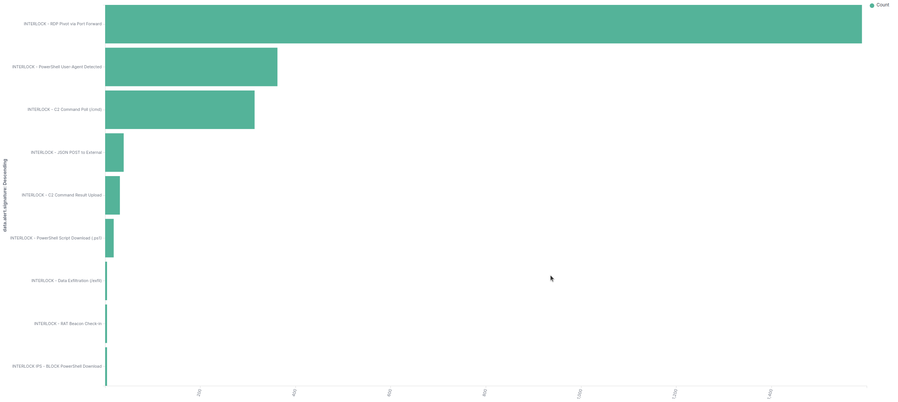

*Figure 65: Visualization 9 - Suricata Signature Hits.*

**Analytical finding.** Every one of the nine custom Suricata signatures fired, confirming complete network-layer coverage of the kill chain. The presence of the IPS BLOCK signature alongside the alert-only signatures demonstrates the two-phase deployment strategy: alert-mode validation followed by IPS-mode blocking. Hit ratios are internally consistent - beacon (2) is much smaller than command poll (314) because the beacon fires once at RAT startup while the poll repeats every 30 seconds.

### 11.11 Visualization 10 - Discovery & Enumeration Activity (Data Table)

**Type:** Data Table · **Field:** `rule.description` (Terms, size 15) · **Filter:** `rule.id: "92031" OR "92021" OR "92052" OR rule.description: *discovery*`

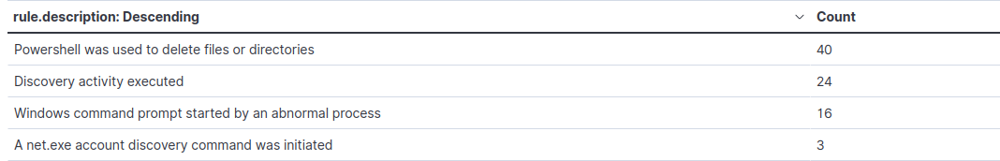

*Figure 66: Visualization 10 - Discovery and Enumeration Activity.*

**Analytical finding.** The 16 "abnormal command prompt" alerts (rule 92052) are the most interesting line - Wazuh flagged the RAT's `cmd /c` command-execution mechanism as suspicious independent of the specific commands being run. That is behavior-based detection that would catch novel attacker commands not covered by signatures, and it pairs naturally with the signature-based 100004/100005/100006 rules.

### 11.12 Dashboard Effectiveness Summary

| Kill Chain Phase | Dashboard Coverage | Visualizations |
|---|---|---|
| Delivery | PowerShell download, User-Agent detection | #1, #6, #9 |
| Exploitation / Execution | PowerShell Bypass, script execution | #1, #3, #6, #8 |
| C2 Communication | Beacon polling, command results, JSON exfil | #1, #2, #6, #9 |
| Discovery | systeminfo, AD enumeration, net user | #3, #10 |
| Lateral Movement | RDP pivot, logon events, pass-the-hash | #5, #7, #9 |
| Automated Response | IPS DROP blocking at Delivery | #4, #9 |

## 12. Detection Coverage Summary

| Attack Phase | Suricata | Zeek | Wazuh |
|---|---|---|---|
| Payload Download | SID 1000001, 1000002 | `PS_Download`, `PowerShell_UA` | Rule 100001 (Bypass) |
| C2 Communication | SID 1000003, 1000005 | `C2_Beacon` notice | Rule 86601 (forwarded) |
| Data Exfiltration | SID 1000004, 1000008 | `Data_Exfil` notice | Rule 100004 (JSON) |
| Persistence | - | - | Rule 100003 (Registry) |
| Discovery | - | - | Rules 92031, 100005 |
| Lateral Movement | SID 1000009, 1000013 | `conn.log` (`:3389`, `:33890`) | Rules 60106, 92657 |
| IPS Blocking | SID 1000010–1000012 | - | Rule 86601 (BLOCK) |

All custom Suricata signatures (9 alert + 3 DROP), all Zeek notice types (6), and all custom Wazuh rules (8) generated actionable alerts during the simulation. The combination of automated IPS blocking and automated SIEM alerting (with `firewall-drop` active response) demonstrates a complete automated detection-and-response pipeline.

## 13. Key Metrics

| Metric | Count |
|---|---:|
| RDP Pivot alerts | 1,591 |
| PowerShell User-Agent detections | 336 |
| C2 Command Poll events | 296 |
| JSON POST to External | 35 |
| C2 Command Result Uploads | 31 |
| PowerShell Script Downloads | 10 |
| IPS BLOCK events | 3 |
| RAT Beacon check-ins | 2 |
| Data Exfiltration events | 2 |

## 14. Skills Demonstrated

Detection Engineering · Threat Emulation · MITRE ATT&CK Mapping · Network Forensics · IDS/IPS Rule Writing · SIEM Engineering & Dashboarding · Active Directory Security · Lateral Movement Detection · Sysmon & Windows Event Log Analysis · PowerShell Tradecraft · Python (Flask) · Bash Automation · Incident Response Workflow.

## 15. Tech Stack

Suricata 7.0.3 · Zeek NSM · Wazuh 4.14.2 · Sysmon (SwiftOnSecurity config) · OpenSearch Dashboards · Ubuntu 24.04 · Windows Server 2019 · Windows 10 Pro · Kali Linux · Flask · PowerShell · nftables / NFQUEUE.

## 16. Repository Structure

```
interlock-rat-threat-simulation/
├── README.md                            (this comprehensive report - repo landing page)
├── LICENSE
├── images/                              (62 figures referenced throughout this report)
├── detection-rules/
│   ├── suricata/
│   │   └── custom.rules                 (9 alert SIDs + 3 DROP SIDs)
│   ├── zeek/
│   │   └── interlock-detect.zeek        (4 custom notice types)
│   └── wazuh/
│       ├── local_rules.xml              (custom rules 100001–100006, 100008, 100009)
│       └── ossec.conf.snippet           (active-response config block)
├── attack-infrastructure/
│   ├── c2_server.py                     (Flask C2: /beacon, /exfil, /cmd, /result)
│   ├── payload.ps1                      (dropper)
│   ├── rat.ps1                          (3-phase RAT: discovery, persistence, beacon loop)
│   └── filefix-lure.html                (KongTuke FileFix social engineering page)
└── automation/
    └── alert_monitor.sh                 (real-time eve.json INTERLOCK parser)
```

## 17. Disclaimer

> ⚠️ This project was conducted entirely within an isolated VMware lab environment for educational purposes as part of SPR600 Security Monitoring at Seneca Polytechnic. All malware, C2 infrastructure, and attack tooling shown here is simulated and intended only for defensive research and detection engineering practice. Do not deploy any code from this repository against systems you do not own or have explicit authorization to test.

---

**Author:** Makhan Singh - Honours Bachelor of Technology in Cybersecurity (IFS), Seneca Polytechnic
**Reference:** [The DFIR Report - *KongTuke FileFix Leads to New Interlock RAT Variant*](https://thedfirreport.com/2025/07/14/kongtuke-filefix-leads-to-new-interlock-rat-variant/)
